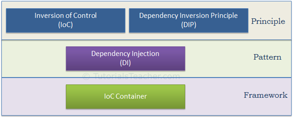

<!-- toc -->
# table-of-contents

- [How to Prepare](#how-to-prepare)
- [Resources](#resources)
  * [Suggested reading](#suggested-reading)
  * [Videos](#videos)
  * [Misc.](#misc)
- [Computer Science](#computer-science)
  * [Data Structures](#data-structures)
  * [Algorithms](#algorithms)
  * [Complexity](#complexity)
- [JavaScript + Web APIs](#javascript--web-apis)
  * [Prototypal Inheritance](#prototypal-inheritance)
  * [Scope](#scope)
  * [Closures](#closures)
  * [Event bubbling](#event-bubbling)
  * [Apply, call, and bind](#apply-call-and-bind)
  * [Hoisting](#hoisting)
  * [Var, Let & Const](#var-let--const)
  * [Arrow Functions](#arrow-functions)
  * [Generator Functions](#generator-functions)
  * [Map vs Object](#map-vs-object)
  * [Virtual DOM](#virtual-dom)
  * [Shadow DOM](#shadow-dom)
  * [Async / Await](#async--await)
  * [Web Workers](#web-workers)
  * [Service Workers](#service-workers)
  * [Miscellaneous](#miscellaneous)
- [Design Patterns](#design-patterns)
  * [Decorator](#decorator)
  * [Factory](#factory)
  * [Singleton](#singleton)
  * [Module](#module)
  * [Facade](#facade)
  * [Observer](#observer)
  * [Strategy Pattern](#strategy-pattern)
  * [Inversion of Control](#inversion-of-control)
  * [Composition vs Inheritance](#composition-vs-inheritance)
- [HTML / CSS](#html--css)
  * [Flexbox](#flexbox)
  * [Transforms](#transforms)
  * [Accessibility](#accessibility)
- [Questions](#questions)
- [Code Quality](#code-Quality)
  * [Introduction](#introduction)
  * [Variables](#variables)
  * [Functions](#functions)
  * [Objects and Data Structures](#objects-and-data-structures)
  * [Classes](#classes)
-[SOLID](#solid)
-[Testing](#testing)
-[Concurrency](#concurrency)
-[Error Handling](#error-handling)
-[Formatting](#formatting)
-[Comments](#comments)

<!-- tocstop -->

# How to Prepare

Invest time in preparing: It's important for any engineer, even senior ones, to brush up on their interview skills, coding skills and algorithms. An interview is typically different from your day-to-day job.

**Practice answering many different coding questions:** Practice answering a coding question with the most efficient bug-free solution without using a compiler. A few resources that offer coding questions to use for practice: [Careercup](https://l.facebook.com/l.php?u=http%3A%2F%2Fwww.careercup.com%2Fpage&h=ATNXGEU22051CK2jrQZuz0-_xpFzm-N44vARqRRGaN11C-Bj2vvn7WakmxepET56eZiatvTQ5pvqo_-swS4N6QtW0wLyqika349D8d17ymipgFcPjfwzH5Ij6wH7PmPc-MTcx2YwK5Yovm8v&s=1), [Topcoder](https://l.facebook.com/l.php?u=http%3A%2F%2Fwww.topcoder.com%2F&h=ATM84NVzQHwje5rS4KBb5NHBfgwbX2g_4I-v4q3gW9I31bL155_2HLWALBAaz-u1XIGY8T7w1xFngHX7f9JT4IzFUw-OECGgW0kHns9mvkGq7tkFG9sQz_Oy3oKpwcwOwnJoXMEin1QmB7id&s=1), [Project Euler](https://l.facebook.com/l.php?u=http%3A%2F%2Fprojecteuler.net%2Findex.php&h=ATPG4D_F0Q_s08m-PKCq6owpQh-cUzeLVDZO2hpdW2Sz03dK80GOAQBL45uEyK73sTqcVHOpXPG-Sd-naTXSuOVwa7TKMiqHcJ72OMhzpwUay472i7xcEjrivGdjUlnSu39Rl-gh3G1T8a-s&s=1), or [Facebook Code Lab](https://l.facebook.com/l.php?u=https%3A%2F%2Fcodelab.interviewbit.com%2F&h=ATMMRfsaHRYEOnw7HsLuQSRHKv2q_tQz63MRO-4U9xFgmowjsV9YadpCd4pxMEPnpm2RnXJ8idkl23HwzzMTmFbwK0VAu8MYvxrPs2jqY0TMHs4VJe-df8N0qAG3D15gW4ZKAjGQKCE2SAni&s=1).

**Go over data structures, algorithms and complexity**: Be able to discuss the **big-O complexity** of your approaches. Don't forget to brush up on your **data structures like lists, arrays, hash tables, hash maps, stacks, queues, graphs, trees, heaps**. Also **sorts, searches, and traversals (BFS, DFS)**.

Also review **recursion and iterative approaches**.

**Think about your 2-5 years career aspirations:** You will be asked to talk about your interest and your strengths as an engineer.

**Prepare 1-2 questions to ask your interviewer:** There is generally 5 minutes at the end of a typical interview for this.

# Resources

## Suggested reading

- [Cracking the Coding Interview](https://l.facebook.com/l.php?u=http%3A%2F%2Fwww.amazon.com%2Fdp%2F0984782850%2F&h=ATMZRtbfTrzQcLHngryrTjFT_XCq2o3nid4NoEE88Unt61VMu5gFILsu62CeZiwgbMGZEsXHIio3myVajcoWduG6CmE2SNFwxgOsHYHdaHWJIaSz20A7UL-X0oS1_Y4HnsCjr2FMWV3QabQf&s=1)
- [Introduction to Algorithms](https://l.facebook.com/l.php?u=http%3A%2F%2Fwww.amazon.com%2Fdp%2F0262033844&h=ATOR-C75elaqF-869Wl2vEifzniqLLc-mNpQXeueUSB7OVXcUN7-lehuzUCmjAgZ_VvnNPPra-ogSE4exCDEjTb2hxaQHSzun9WU0eN94HDmr58g7ibkPOCFv2Cns6eQcvcH72WAD9yfxcyI&s=1)
- [Algorithms in C](http://www.amazon.com/Algorithms-Parts-1-5-Bundle-Fundamentals/dp/0201756080)
- [Data Structures and Algorithms](https://apps2.mdp.ac.id/perpustakaan/ebook/Karya%20Umum/Dsa.pdf) and [Big-O Cheat Sheet](http://bigocheatsheet.com/)
- [Coursera - Algorithms, Part 1](https://www.coursera.org/learn/algorithms-part1)
- [Coursera - Algorithms, Part 2](https://www.coursera.org/learn/algorithms-part2)
- [Udacity - Intro to Algorithms](https://www.udacity.com/course/intro-to-algorithms--cs215)
- [MIT Open courseware - Introduction to Algorithms](https://ocw.mit.edu/courses/electrical-engineering-and-computer-science/6-006-introduction-to-algorithms-spring-2008/)
- “You Don’t Know JS” by Kyle Simpson - https://github.com/getify/You-Dont-Know-JS
- [Cracking the javascript interview](https://medium.com/dev-bits/a-perfect-guide-for-cracking-a-javascript-interview-a-developers-perspective-23a5c0fa4d0d)
- [Data Structures and Algorithms Tutorial](https://www.scaler.com/topics/data-structures/)
- [Cracking the Coding Interview (JS) Solutions](https://github.com/careercup/CtCI-6th-Edition-JavaScript)
- [Tech Interview Handbook](https://techinterviewhandbook.org/)
- [Front End Interview Handbook](https://frontendinterviewhandbook.com/)

### Practice questions

- [Awesome JavaScript Interviews](https://github.com/rohan-paul/Awesome-JavaScript-Interviews)
- [500 Data Structures and Algorithms ](https://techiedelight.quora.com/500-Data-Structures-and-Algorithms-interview-questions-and-their-solutions)
- [Top 10 Algos in Interview Questions](http://www.geeksforgeeks.org/top-10-algorithms-in-interview-questions/)
- [HackerRank](https://www.hackerrank.com/), [Topcoder](https://community.topcoder.com/tc?module=MatchDetails&rd=15712), [Codeforces](http://codeforces.com/contests), [Leetcode](https://leetcode.com/), [InterviewBit](https://www.interviewbit.com/) or [Kattis.](https://open.kattis.com/)
- Problems from[ Cracking the Coding Interview Book](https://books.google.co.uk/books/about/Cracking_the_Coding_Interview.html?id=anhAXwAACAAJ&hl=en)
- List of [ACM-ICPC](https://icpc.baylor.edu/worldfinals/problems) and [Code Jam](https://code.google.com/codejam/past-contests) past questions

## Videos

- [Clean Code](https://www.youtube.com/watch?v=RlfLCWKxHJ0)

## Misc.

- [Flexbox Froggy](http://flexboxfroggy.com/)

# Computer Science

## Data Structures

Data structures can implement one or more particular abstract data types (ADT), which specify the operations that can be performed on a data structure and the computational complexity of those operations. In comparison, a data structure is a concrete implementation of the specification provided by an ADT.

Different kinds of data structures are suited to different kinds of applications, and some are highly specialised to specific tasks. For example, relational databases commonly use B-tree indexes for data retrieval, while compiler implementations usually use hash tables to look up identifiers.

Data structures provide a means to manage large amounts of data efficiently for uses such as large databases and internet indexing services. Usually, efficient data structures are key to designing efficient algorithms. Some formal design methods and programming languages emphasise data structures, rather than algorithms, as the key organising factor in software design. Data structures can be used to organise the storage and retrieval of information stored in both main memory and secondary memory.

### Lists

A **linked list** is a linear collection of data elements, in which linear order is not given by their physical placement in memory. Each pointing to the next node by means of a [pointer](<https://en.wikipedia.org/wiki/Pointer_(computer_programming)>). It is a [data structure](https://en.wikipedia.org/wiki/Data_structure) consisting of a group of [nodes](<https://en.wikipedia.org/wiki/Node_(computer_science)>) which together represent a [sequence](https://en.wikipedia.org/wiki/Sequence). Under the simplest form, each node is composed of data and a [reference](<https://en.wikipedia.org/wiki/Reference_(computer_science)>) (in other words, a _link_) to the next node in the sequence. This structure allows for efficient insertion or removal of elements from any position in the sequence during iteration. More complex variants add additional links, allowing efficient insertion or removal from arbitrary element references.

Linked lists are among the simplest and most common data structures. They can be used to implement several other common [abstract data types](https://en.wikipedia.org/wiki/Abstract_data_type), including [lists](<https://en.wikipedia.org/wiki/List_(abstract_data_type)>) (the abstract data type), [stacks](<https://en.wikipedia.org/wiki/Stack_(abstract_data_type)>), [queues](<https://en.wikipedia.org/wiki/Queue_(abstract_data_type)>), [associative arrays](https://en.wikipedia.org/wiki/Associative_array), and [S-expressions](https://en.wikipedia.org/wiki/S-expression), though it is not uncommon to implement the other data structures directly without using a list as the basis of implementation.

### Stacks

A **stack** is an [abstract data type](https://en.wikipedia.org/wiki/Abstract_data_type) that serves as a [collection](<https://en.wikipedia.org/wiki/Collection_(computing)>) of elements, with two principal operations: _push_, which adds an element to the collection, and _pop_, which removes the most recently added element that was not yet removed. The order in which elements come off a stack gives rise to its alternative name, **LIFO**(for **last in, first out**). Additionally, a [_peek_](<https://en.wikipedia.org/wiki/Peek_(data_type_operation)>) operation may give access to the top without modifying the stack.

The name "stack" for this type of structure comes from the analogy to a set of physical items stacked on top of each other, which makes it easy to take an item off the top of the stack, while getting to an item deeper in the stack may require taking off multiple other items first.[[1\]](<https://en.wikipedia.org/wiki/Stack_(abstract_data_type)#cite_note-clrs-1>)

Considered as a [linear data structure](https://en.wikipedia.org/wiki/Linear_data_structure), or more abstractly a sequential collection, the push and pop operations occur only at one end of the structure, referred to as the _top_ of the stack. This makes it possible to implement a stack as a [singly linked list](https://en.wikipedia.org/wiki/Singly_linked_list) and a pointer to the top element.

A stack may be implemented to have a bounded capacity. If the stack is full and does not contain enough space to accept an entity to be pushed, the stack is then considered to be in an [overflow](https://en.wikipedia.org/wiki/Stack_overflow) state. The pop operation removes an item from the top of the stack.

```javascript
var stack = [];

stack.push(2); // stack is now [2]
stack.push(5); // stack is now [2, 5]

var i = stack.pop(); // stack is now [2]

alert(i); // displays 5
```

### Queues

A **queue** is a particular kind of [abstract data type](https://en.wikipedia.org/wiki/Abstract_data_type) or [collection](<https://en.wikipedia.org/wiki/Collection_(abstract_data_type)>) in which the entities in the collection are kept in order and the principal (or only) operations on the collection are the addition of entities to the rear terminal position, known as _enqueue,_ and removal of entities from the front terminal position, known as _dequeue_. This makes the queue a [First-In-First-Out (FIFO) data structure](<https://en.wikipedia.org/wiki/FIFO_(computing_and_electronics)>). In a FIFO data structure, the first element added to the queue will be the first one to be removed. This is equivalent to the requirement that once a new element is added, all elements that were added before have to be removed before the new element can be removed. Often a _peek_ or _front_ operation is also entered, returning the value of the front element without dequeuing it. A queue is an example of a [linear data structure](https://en.wikipedia.org/wiki/Linear_data_structure), or more abstractly a sequential collection.

Queues provide services in [computer science](https://en.wikipedia.org/wiki/Computer_science), [transport](https://en.wikipedia.org/wiki/Transport), and [operations research](https://en.wikipedia.org/wiki/Operations_research) where various entities such as data, objects, persons, or events are stored and held to be processed later. In these contexts, the queue performs the function of a [buffer](<https://en.wikipedia.org/wiki/Buffer_(computer_science)>).

Queues are common in computer programs, where they are implemented as data structures coupled with access routines, as an [abstract data structure](https://en.wikipedia.org/wiki/Abstract_data_structure) or in object-oriented languages as classes. Common implementations are [circular buffers](https://en.wikipedia.org/wiki/Circular_buffer) and [linked lists](https://en.wikipedia.org/wiki/Linked_list).

```javascript
var queue = [];

queue.push(2); // queue is now [2]
queue.push(5); // queue is now [2, 5]

var i = queue.shift(); // queue is now [5]

alert(i); // displays 2
```

### Priority Queue

Priority Queue is similar to queue where we insert an element from the back and remove an element from front, but with a one difference that the logical order of elements in the priority queue depends on the priority of the elements. The element with highest priority will be moved to the front of the queue and one with lowest priority will move to the back of the queue. Thus it is possible that when you enqueue an element at the back in the queue, it can move to front because of its highest priority.

Let’s say we have an array of 5 elements : {4, 8, 1, 7, 3} and we have to insert all the elements in the max-priority queue.

- First as the priority queue is empty, so 4 will be inserted initially.
- Now when 8 will be inserted it will moved to front as 8 is greater than 4.
- While inserting 1, as it is the current minimum element in the priority queue, it will remain in the back of priority queue.
- Now 7 will be inserted between 8 and 4 as 7 is smaller than 8.
- Now 3 will be inserted before 1 as it is the 2nd minimum element in the priority queue.

**Naive Approach:**
Suppose we have N elements and we have to insert these elements in the priority queue. We can use list and can insert elements in O(N) time and can sort them to maintain a priority queue in O(N logN ) time.

**Efficient Approach:**
We can use **heaps to implement the priority queue**. It will take O(log N) time to insert and delete each element in the priority queue.

Based on heap structure, priority queue also has two types max-priority queue and min-priority queue.

Example Implementation:

```javascript
class MaxHeap {
  constructor() {
    this._heap = [];
  }

  _getParent(index) {
    return this._heap[(index - 1) / 2];
  }

  _getLeftChild(parentIndex) {
    return this._heap[2 * parentIndex + 1];
  }

  _getRightChild(parentIndex) {
    return this._heap[2 * parentIndex + 2];
  }

  _bubbleUp(index) {
    const parentIndex = (index - 1) / 2;

    if (parentIndex === 0) return;

    if (this._getParent(index) < this._heap[index]) {
      this._swap(parentIndex, index);
      this._bubbleUp(parentIndex);
    }
  }

  _sinkDown(index) {
    const rightChildIndex = 2 * parentIndex + 2;

    if (this._getRightChild(index) > this._heap.length) {
      return;
    }

    if (this._getRightChild(index) > this._heap[index]) {
      this._swap(index, rightChildIndex);
      this._sinkDown(rightChildIndex);
    }
  }

  _swap(indexOne, indexTwo) {
    const temp = this._heap[indexOne];
    this._heap[indexOne] = this._heap[indexTwo];
    this._heap[indexTwo] = temp;
  }

  push(value) {
    this._heap.push(value);

    // Insert an element to the end of the heap
    // If it's parent is smaller (max heap) or larger (min heap) It means we have
    // a heap violation. We should swap the child (newly added value)
    // with the parent until we restore the heap property
    this._bubbleUp(this.heap.length);
  }

  pop() {
    // Remove the first element in the heap. Swap the last element in the heap to the front.
    // Sink down swapping with the right child until a position is found
    const max = this._heap.shift();
    this._swap(0, this._heap.length);
    this._heap.pop();
    this._sinkDown();

    return max;
  }

  peek() {
    this._heap[0];
  }
}

class PriorityQueue {
  // NOTE: Passing your heap implementation will
  // allow you to switch from min to max heap with ease
  constructor(heap) {
    this._heap = heap;
  }
  enqueue(value) {
    this._heap.push(value);
  }
  dequeue() {
    this._heap.pop(value);
  }
  peek() {
    this._heap.peek();
  }
}

const priorityQueue = new PriorityQueue(new MaxHeap());
```

### Hash Tables

A **hash table** (**hash map**) is a data structure which implements an associative array abstract data type, a structure that can map keys to values. A hash table uses a hash function to compute an index into an array of buckets or slots, from which the desired value can be found.

Ideally, the hash function will assign each key to a unique bucket, but most hash table designs employ an imperfect hash function, which might cause hash _collisions_ where the hash function generates the same index for more than one key. Such collisions must be accommodated in some way.

In a well-dimensioned hash table, the average cost (number of instructions) for each lookup is independent of the number of elements stored in the table. Many hash table designs also allow arbitrary insertions and deletions of key-value pairs, at constant average cost per operation.

In many situations, **hash tables turn out to be more efficient than search trees or any other table lookup structure.** For this reason, **they are widely used in many kinds of computer software, particularly for associative arrays, database indexing, caches, and sets**.

#### Hash functions

All a hash function does is turn a value into an array index. The hash function in turn is composed of two parts.

The first part, the _hash code_, takes a value and returns an integer. A function that always returned zero would be a hash coding function, but it would be a terrible one. More terrible ones include adding the ASCII values of a string together, multiplying the digits of a number, etc. A good hashing function minimizes the chance of a hash collision; a hash collision is when two distinct values have the same hash code. Good hashing functions, like SHA-256, have extremely small probabilities of hash collisions. I've heard that it's much more likely that a giant asteroid will impact the earth than a collision of SHA-256 ever happening in the wild. The second part of hash functions is the _compression mapping_. All this does is maps the integer to an array index using the modulus operator and the length of the underlying array.

A good hash function should be extremely fast to compute. Cryptographic-strength has functions often are relatively slow to compute, so faster ones are used that have higher collision rates. So how do we manage collisions?

### Graphs

A **graph** is an [abstract data type](https://en.wikipedia.org/wiki/Abstract_data_type) that is meant to implement the [undirected graph](<https://en.wikipedia.org/wiki/Graph_(discrete_mathematics)>) and [directed graph](https://en.wikipedia.org/wiki/Directed_graph) concepts from [mathematics](https://en.wikipedia.org/wiki/Mathematics), specifically the field of [graph theory](https://en.wikipedia.org/wiki/Graph_theory).

A graph data structure consists of a finite (and possibly mutable) [set](<https://en.wikipedia.org/wiki/Set_(computer_science)>) of _vertices_ or _nodes_, together with a set of unordered pairs of these vertices for an undirected graph or a set of ordered pairs for a directed graph. These pairs are known as _edges_, _arcs_, or _lines_ for an undirected graph and as _arrows_, _directed edges_, _directed arcs_, or _directed lines_ for a directed graph. The vertices may be part of the graph structure, or may be external entities represented by integer indices or [references](<https://en.wikipedia.org/wiki/Reference_(computer_science)>).

A graph data structure may also associate to each edge some _edge value_, such as a symbolic label or a numeric attribute (cost, capacity, length, etc.).


### Trees

A **tree** is a widely used [abstract data type](https://en.wikipedia.org/wiki/Abstract_data_type) (ADT)—or [data structure](https://en.wikipedia.org/wiki/Data_structure) implementing this ADT—that simulates a hierarchical [tree structure](https://en.wikipedia.org/wiki/Tree_structure), with a root value and [subtrees](https://en.wikipedia.org/wiki/Subtrees) of children with a parent node, represented as a set of linked [nodes](<https://en.wikipedia.org/wiki/Vertex_(graph_theory)>).

A tree data structure can be defined [recursively](https://en.wikipedia.org/wiki/Recursion) (locally) as a collection of [nodes](<https://en.wikipedia.org/wiki/Node_(computer_science)>) (starting at a root node), where each node is a data structure consisting of a value, together with a list of references to nodes (the "children"), with the constraints that no reference is duplicated, and none points to the root.

Alternatively, a tree can be defined abstractly as a whole (globally) as an [ordered tree](https://en.wikipedia.org/wiki/Ordered_tree), with a value assigned to each node. Both these perspectives are useful: while a tree can be analyzed mathematically as a whole, when actually represented as a data structure it is usually represented and worked with separately by node (rather than as a list of nodes and an [adjacency list](https://en.wikipedia.org/wiki/Adjacency_list) of edges between nodes, as one may represent a [digraph](<https://en.wikipedia.org/wiki/Tree_(data_structure)#Digraphs>), for instance). For example, looking at a tree as a whole, one can talk about "the parent node" of a given node, but in general as a data structure a given node only contains the list of its children, but does not contain a reference to its parent (if any)

**Terminoligy**

- **Root:** The top node in a tree.
- **Child:** A node directly connected to another node when moving away from the Root.
- **Parent:** The converse notion of a child.
- **Siblings:** A group of nodes with the same parent.
- **Descendant:** A node reachable by repeated proceeding from parent to child.
- **Ancestor:** A node reachable by repeated proceeding from child to parent.
- **Leaf:** A node with no children.

### Binary Trees

A **binary tree** is a [tree](https://en.wikipedia.org/wiki/Tree_structure) [data structure](https://en.wikipedia.org/wiki/Data_structure) in which **each node has at most two [children](https://en.wikipedia.org/wiki/Child_node)**, which are referred to as the _left child_ and the _right child_. A [recursive definition](https://en.wikipedia.org/wiki/Recursive_definition) using just [set theory](https://en.wikipedia.org/wiki/Set_theory) notions is that a (non-empty) binary tree is a [triple](https://en.wikipedia.org/wiki/Tuple) (_L_, _S_, _R_), where _L_ and _R_ are binary trees or the [empty set](https://en.wikipedia.org/wiki/Empty_set) and _S_ is a [singleton set](https://en.wikipedia.org/wiki/Singleton_set). Some authors allow the binary tree to be the empty set as well.

From a [graph theory](https://en.wikipedia.org/wiki/Graph_theory) perspective, binary (and K-ary) trees as defined here are actually [arborescences](<https://en.wikipedia.org/wiki/Arborescence_(graph_theory)>). A binary tree may thus be also called a **bifurcating arborescence**—a term which appears in some very old programming books, before the modern computer science terminology prevailed. It is also possible to interpret a binary tree as an [undirected](https://en.wikipedia.org/wiki/Undirected_graph), rather than a [directed graph](https://en.wikipedia.org/wiki/Directed_graph), in which case a binary tree is an [ordered](https://en.wikipedia.org/wiki/Ordered_tree), [rooted tree](https://en.wikipedia.org/wiki/Rooted_tree). Some authors use **rooted binary tree** instead of _binary tree_ to emphasize the fact that the tree is rooted, but as defined above, a binary tree is always rooted. A binary tree is a special case of an ordered [K-ary tree](https://en.wikipedia.org/wiki/K-ary_tree), where _k_ is 2.

In computing, binary trees are seldom used solely for their structure. Much more typical is to define a labeling function on the nodes, which associates some value to each node. Binary trees labelled this way are used to implement [binary search trees](https://en.wikipedia.org/wiki/Binary_search_tree) and [binary heaps](https://en.wikipedia.org/wiki/Binary_heap), and are used for efficient [searching](https://en.wikipedia.org/wiki/Search_algorithm) and [sorting](https://en.wikipedia.org/wiki/Sorting_algorithm). The designation of non-root nodes as left or right child even when there is only one child present matters in some of these applications, in particular it is significant in binary search trees. In mathematics, what is termed _binary tree_ can vary significantly from author to author. Some use the definition commonly used in computer science, but others define it as every non-leaf having exactly two children and don't necessarily order (as left/right) the children either.


### Binary Search Trees

**Binary Search Trees (BST)**, are a particular type of data structure. They allow fast lookup, addition and removal of items, and can be used to implement either dynamic sets of items, or lookup tables that allow finding an item by its key (e.g., finding the phone number of a person by name).

**Binary search trees keep their keys in sorted order**, so that lookup and other operations can use the principle of **binary search**: when looking for a key in a tree (or a place to insert a new key), they traverse the tree from root to leaf, making comparisons to keys stored in the nodes of the tree and deciding, based on the comparison, to continue searching in the left or right subtrees. On average, this means that each comparison allows the operations to skip about half of the tree, so that each lookup, insertion or deletion takes time proportional to the logarithm of the number of items stored in the tree. This is much better than the linear time required to find items by key in an (unsorted) array, but slower than the corresponding operations on hash tables.


**Searching**

Searching a binary search tree for a specific key can be programmed recursively or iteratively.

Begin by examining the root node. If the tree is null, the key we are searching for does not exist in the tree. Otherwise, if the key equals that of the root, the search is successful and we return the node. If the key is less than that of the root, we search the left subtree. Similarly, if the key is greater than that of the root, we search the right subtree. This process is repeated until the key is found or the remaining subtree is null. If the searched key is not found after a null subtree is reached, then the key is not present in the tree. This is easily expressed as a recursive algorithm (implemented in Python):

```python
1 def search_recursively(key, node):
2     if node is None or node.key == key:
3         return node
4     if key < node.key:
5         return search_recursively(key, node.left)
6     # key > node.key
7     return search_recursively(key, node.right)
```

The same algorithm can be implemented iteratively:

```python
 1 def search_iteratively(key, node):
 2     current_node = node
 3     while current_node is not None:
 4         if key == current_node.key:
 5             return current_node
 6         elif key < current_node.key:
 7             current_node = current_node.left
 8         else: # key > current_node.key:
 9             current_node = current_node.right
10     return None
```

### Heaps

Heap is a special case of balanced binary tree data structure where the root-node key is compared with its children and arranged accordingly.

If **α** has child node **β** then − **key(α) ≥ key(β)**

As the value of parent is greater than that of child, this property generates **Max Heap**. Based on this criteria, a heap can be of two types −

**Max-Heap** − Where the value of the root node is greater than or equal to either of its children.


**Min-Heap** − Where the value of the root node is less than or equal to either of its children.


The heap is one maximally efficient implementation of an [abstract data type](https://en.wikipedia.org/wiki/Abstract_data_type) called a [priority queue](https://en.wikipedia.org/wiki/Priority_queue), and in fact priority queues are often referred to as "heaps", regardless of how they may be implemented.

Heaps are also crucial in several efficient [graph](https://en.wikipedia.org/wiki/Graph_theory) [algorithms](https://en.wikipedia.org/wiki/Algorithm) such as [Dijkstra's algorithm](https://en.wikipedia.org/wiki/Dijkstra%27s_algorithm). In a heap, the highest (or lowest) priority element is always stored at the root. A heap is not a sorted structure and can be regarded as partially ordered. As visible from the heap-diagram, there is no particular relationship among nodes on any given level, even among the siblings. When a heap is a complete binary tree, it has a smallest possible height—a heap with N nodes always has **log N height**.

A heap is a useful data structure when you need to remove the object with the highest (or lowest) priority.

## Algorithms

### Bubble sort

A **simple** sorting algorithm that repeatedly steps through the list to be sorted, **compares each pair of adjacent items and swaps them if they are in the wrong order (ie if 4 is next to 1, they will be swapped.** The pass through the list is repeated until no swaps are needed, which indicates that the list is sorted. The algorithm, which is a [comparison sort](https://en.wikipedia.org/wiki/Comparison_sort), is named for the way smaller or larger elements "bubble" to the top of the list. Although the algorithm is simple, it is too slow and impractical for most problems even when compared to insertion sort. It can be practical if the input is usually in sorted order but may occasionally have some out-of-order elements nearly in position.

### Insertion sort

**Insertion sort** is a simple [sorting algorithm](https://en.wikipedia.org/wiki/Sorting_algorithm) that builds the final [sorted array](https://en.wikipedia.org/wiki/Sorted_array) (or list) one item at a time. It is much less efficient on large lists than more advanced algorithms such as [quicksort](https://en.wikipedia.org/wiki/Quicksort), [heapsort](https://en.wikipedia.org/wiki/Heapsort), or [merge sort](https://en.wikipedia.org/wiki/Merge_sort). However, insertion sort provides several advantages:

- Simple implementation
- Efficient for (quite) small data sets, much like other quadratic sorting algorithms
- More efficient in practice than most other simple quadratic (i.e., [O](https://en.wikipedia.org/wiki/Big_O_notation)(*n*2)) algorithms such as [selection sort](https://en.wikipedia.org/wiki/Selection_sort) or [bubble sort](https://en.wikipedia.org/wiki/Bubble_sort)
- [Adaptive](https://en.wikipedia.org/wiki/Adaptive_sort), i.e., efficient for data sets that are already substantially sorted: the [time complexity](https://en.wikipedia.org/wiki/Time_complexity) is _O_(_nk_) when each element in the input is no more than k places away from its sorted position
- [Stable](https://en.wikipedia.org/wiki/Stable_sort); i.e., does not change the relative order of elements with equal keys
- [In-place](https://en.wikipedia.org/wiki/In-place_algorithm); i.e., only requires a constant amount O(1) of additional memory space
- [Online](https://en.wikipedia.org/wiki/Online_algorithm); i.e., can sort a list as it receives it

When people manually sort cards in a bridge hand, most use a method that is similar to insertion sort.

### Merge sort

**merge sort** (also commonly spelled **mergesort**) is an efficient, general-purpose, [comparison-based](https://en.wikipedia.org/wiki/Comparison_sort) [sorting algorithm](https://en.wikipedia.org/wiki/Sorting_algorithm). Most implementations produce a [stable sort](https://en.wikipedia.org/wiki/Sorting_algorithm#Stability), which means that the implementation preserves the input order of [equal](<https://en.wikipedia.org/wiki/Equality_(mathematics)>) elements in the sorted output. Mergesort is a divide and conquer algorithm.

An example of merge sort. First divide the list into the smallest unit (1 element), then compare each element with the adjacent list to sort and merge the two adjacent lists. Finally all the elements are sorted and merged.

### Quick sort

Quicksort (sometimes called partition-exchange sort) is an efficient sorting algorithm, serving as a systematic method for placing the elements of an array in order.

Quicksort is a comparison sort, meaning that it can sort items of any type for which a "less-than" relation (formally, a total order) is defined. In efficient implementations it is not a stable sort, meaning that the relative order of equal sort items is not preserved. Quicksort can operate in-place on an array, requiring small additional amounts of memory to perform the sorting.

Mathematical analysis of quicksort shows that, on average, the algorithm takes O(n log n) comparisons to sort n items. In the worst case, it makes O(n2) comparisons, though this behavior is rare.

Quicksort first divides a large array into two smaller sub-arrays: the low elements and the high elements. Quicksort can then recursively sort the sub-arrays.

**The steps are:**

- Pick an element, called a pivot, from the array.
- Partitioning: reorder the array so that all elements with values less than the pivot come before the pivot, while all elements with values greater than the pivot come after it (equal values can go either way). After this partitioning, the pivot is in its final position. This is called the partition operation.
- Recursively apply the above steps to the sub-array of elements with smaller values and separately to the sub-array of elements with greater values.

The base case of the recursion is arrays of size zero or one, which never need to be sorted.

The pivot selection and partitioning steps can be done in several different ways; the choice of specific implementation schemes greatly affects the algorithm's performance.

### Selection sort

In computer science, selection sort is a sorting algorithm, specifically an in-place comparison sort. It has O(n2) time complexity, making it inefficient on large lists, and generally performs worse than the similar insertion sort. Selection sort is noted for its simplicity, and it has performance advantages over more complicated algorithms in certain situations, particularly where auxiliary memory is limited.

The algorithm divides the input list into two parts: the sublist of items already sorted, which is built up from left to right at the front (left) of the list, and the sublist of items remaining to be sorted that occupy the rest of the list. Initially, the sorted sublist is empty and the unsorted sublist is the entire input list. The algorithm proceeds by finding the smallest (or largest, depending on sorting order) element in the unsorted sublist, exchanging (swapping) it with the leftmost unsorted element (putting it in sorted order), and moving the sublist boundaries one element to the right.

### Searches

**Binary search**: Finds the position of a target value within a **sorted array**. Binary search compares the target value to the middle element of the array; if they are unequal, the half in which the target cannot lie is eliminated and the search continues on the remaining half until it is successful. If the search ends with the remaining half being empty, the target is not in the array.

### Traversals

Graph traversal means visiting every vertex and edge exactly once in a well-defined order. While using certain graph algorithms, you must ensure that each vertex of the graph is visited exactly once. The order in which the vertices are visited are important and may depend upon the algorithm or question that you are solving.

During a traversal, it is important that you track which vertices have been visited. The most common way of tracking vertices is to mark them.

### Breadth First Search (BFS)

BFS is the most commonly used approach to traverse a graph.

BFS is a traversing algorithm where you should start traversing from a **selected node (source or starting node)** and traverse the graph **layerwise** thus exploring the neighbour nodes (nodes which are directly connected to source node). You must then move towards the next-level neighbour nodes.

As the name BFS suggests, you are required to traverse the graph breadthwise as follows:

1. First move horizontally and visit all the nodes of the current layer
2. Move to the next layer


The distance between the nodes in layer 1 is comparitively lesser than the distance between the nodes in layer 2. Therefore, in BFS, you must traverse all the nodes in layer 1 before you move to the nodes in layer 2.

**Traversing child nodes**

A graph can contain cycles, which may bring you to the same node again while traversing the graph. To avoid processing of same node again, use a boolean array which marks the node after it is processed. While visiting the nodes in the layer of a graph, store them in a manner such that you can traverse the corresponding child nodes in a similar order.

In the earlier diagram, start traversing from 0 and visit its child nodes 1, 2, and 3. Store them in the order in which they are visited. This will allow you to visit the child nodes of 1 first (i.e. 4 and 5), then of 2 (i.e. 6 and 7), and then of 3 (i.e. 7) etc.

To make this process easy, use a queue to store the node and mark it as 'visited' until all its neighbours (vertices that are directly connected to it) are marked. The queue follows the First In First Out (FIFO) queuing method, and therefore, the neigbors of the node will be visited in the order in which they were inserted in the node i.e. the node that was inserted first will be visited first, and so on.

```
BFS (G, s)                   //Where G is the graph and s is the source node
    let Q be queue.
    Q.enqueue( s ) //Inserting s in queue until all its neighbour vertices are marked.

    mark s as visited.
    while ( Q is not empty)
        //Removing that vertex from queue,whose neighbour will be visited now
        v  =  Q.dequeue( )

        //processing all the neighbours of v
        for all neighbours w of v in Graph G
           if w is not visited
               Q.enqueue( w )             //Stores w in Q to further visit its neighbour
               mark w as visited.
```

### Depth First Search (DFS)

The DFS algorithm is a recursive algorithm that uses the idea of **backtracking**. It involves exhaustive searches of all the nodes by going ahead, if possible, else by backtracking.

Here, the word backtrack means that when you are moving forward and there are no more nodes along the current path, you move backwards on the same path to find nodes to traverse. All the nodes will be visited on the current path till all the unvisited nodes have been traversed after which the next path will be selected.


This recursive nature of DFS can be implemented using stacks. The basic idea is as follows:

1. Pick a starting node and push all its adjacent nodes into a stack.
2. Pop a node from stack to select the next node to visit and push all its adjacent nodes into a stack.
3. Repeat this process until the stack is empty. However, ensure that the nodes that are visited are marked. This will prevent you from visiting the same node more than once. If you do not mark the nodes that are visited and you visit the same node more than once, you may end up in an infinite loop.

```
// iterative
DFS-iterative (G, s):  //Where G is graph and s is source vertex
      let S be stack
      S.push( s )            //Inserting s in stack
      mark s as visited.
      while ( S is not empty):
          //Pop a vertex from stack to visit next
          v  =  S.top( )
         S.pop( )
         //Push all the neighbours of v in stack that are not visited
        for all neighbours w of v in Graph G:
            if w is not visited :
                     S.push( w )
                    mark w as visited

// recursive
DFS-recursive(G, s):
        mark s as visited
        for all neighbours w of s in Graph G:
            if w is not visited:
                DFS-recursive(G, w)
```

## Complexity

https://en.wikipedia.org/wiki/Big_O_notation


**Big O notation is the language we use for articulating how long an algorithm takes to run**. It's how we compare the efficiency of different approaches to a problem.

With big O notation we express the runtime in terms of how quickly it grows relative to the input, as the input gets arbitrarily large.

1. **how quickly the runtime grows**—Some external factors affect the time it takes for a function to run: the speed of the processor, what else the computer is running, etc. So it's hard to make strong statements about the _exact runtime_ of an algorithm. Instead we use big O notation to express _how quickly its runtime grows_.
2. **relative to the input**—Since we're not looking at an exact number, we need to phrase our runtime growth in terms of something. We use the size of the input. So we can say things like the runtime grows "on the order of the size of the input" (O(n)O(n)) or "on the order of the square of the size of the input" (O(n^2)O(n2)).
3. **as the input gets arbitrarily large**—Our algorithm may have steps that seem expensive when nn is small but are eclipsed eventually by other steps as nn gets huge. For big O analysis, we care most about the stuff that grows fastest as the input grows, because everything else is quickly eclipsed as nn gets very large. If you know what an asymptote is, you might see why "big O analysis" is sometimes called "asymptotic analysis."

**Note:** Often this "worst case" stipulation is implied.


### Examples

**This function runs in O(1) time (or "constant time") relative to its input**. The input arraycould be 1 item or 1,000 items, but this function would still just require one "step."

```javascript
function printFirstItem(arrayOfItems) {
  console.log(arrayOfItems[0]);
}
```

**This function runs in O(n) time (or "linear time"), where n is the number of items in the array**. If the array has 10 items, we have to print 10 times. If it has 1,000 items, we have to print 1,000 times.

```javascript
function printAllItems(arrayOfItems) {
  arrayOfItems.forEach(function (item) {
    console.log(item);
  });
}
```

Here we're nesting two loops. If our array has n items, our outer loop runs n times and our inner loop runs _n times for each iteration of the outer loop_, giving us n^2 total prints. Thus **this function runs in O(n^2) time (or "quadratic time")**. If the array has 10 items, we have to print 100 times. If it has 1,000 items, we have to print 1,000,000 times.

```javascript
function printAllPossibleOrderedPairs(arrayOfItems) {
  arrayOfItems.forEach(function (firstItem) {
    arrayOfItems.forEach(function (secondItem) {
      console.log(firstItem, secondItem);
    });
  });
}
```

### Drop the constants

When you're calculating the big O complexity of something, you just throw out the constants. So the below is O(2n), which we just call O(n).

```javascript
function printAllItemsTwice(theArray) {
  theArray.forEach(function (item) {
    // O(n)
    console.log(item);
  });

  // once more, with feeling
  theArray.forEach(function (item) {
    // O(n)
    console.log(item);
  });

  // O(n) + O(n) = O(n^2)
  //             = O(n)
}
```

### Logarithms

A common example of a logarithms is the Binary search:

**Binary search** is a technique used to search sorted data sets. It works by selecting the middle element of the data set, and compares it against a target value. If the values match it will return success. If the target value is higher than the value of the probe element it will take the upper half of the data set and perform the same operation against it. Likewise, if the target value is lower than the value of the probe element it will perform the operation against the lower half. It will continue to halve the data set with each iteration until the value has been found or until it can no longer split the data set.

This type of algorithm is described as **O(log N)**. The iterative halving of data sets described in the binary search example produces a growth curve that peaks at the beginning and slowly flattens out as the size of the data sets increase e.g. an input data set containing 10 items takes one second to complete, a data set containing 100 items takes two seconds, and a data set containing 1000 items will take three seconds. Doubling the size of the input data set has little effect on its growth as after a single iteration of the algorithm the data set will be halved and therefore on a par with an input data set half the size. This makes algorithms like binary search extremely efficient when dealing with large data sets.

# JavaScript + Web APIs

https://www.sitepoint.com/5-typical-javascript-interview-exercises/

## Prototypal Inheritance

[Prototypal inheritance](https://developer.mozilla.org/en-US/docs/Web/JavaScript/Inheritance_and_the_prototype_chain)

When it comes to inheritance, JavaScript only has one construct: objects. Each object has a private property (referred to as `[[Prototype]]` ) which holds a link to another object called its **prototype**. That prototype object has a prototype of its own, and so on until an object is reached with `null` as its prototype. By definition, `null` has no prototype, and acts as the final link in this **prototype chain**.

Nearly all objects in JavaScript are instances of [`Object`](https://developer.mozilla.org/en-US/docs/Web/JavaScript/Reference/Global_Objects/Object) which sits on the top of a prototype chain.

While this is often considered to be one of JavaScript's weaknesses, the prototypal inheritance model is in fact more powerful than the classic model. It is, for example, fairly trivial to build a classic model on top of a prototypal model.

### What’s the Difference Between Class & Prototypal Inheritance?

**Class Inheritance:** **A class is like a blueprint — a description of the object to be created.** Classes inherit from classes and **create subclass relationships**: hierarchical class taxonomies.

Instances are typically instantiated via constructor functions with the *`new`*keyword. Class inheritance may or may not use the _`class`_ keyword from ES6. Classes as you may know them from languages like Java don’t technically exist in JavaScript. Constructor functions are used, instead. The ES6 _`class`_ keyword desugars to a constructor function:

```
class Foo {}
typeof Foo // 'function'
```

In JavaScript, class inheritance is implemented on top of prototypal inheritance, but that does not mean that it does the same thing:

JavaScript’s class inheritance uses **the prototype chain** to wire the child _`Constructor.prototype`_ to the parent _`Constructor.prototype`_ for delegation. Usually, the _`super()`_ constructor is also called. Those steps form **single-ancestor parent/child hierarchies** and **create the tightest coupling available in OO design.**

**Prototypal Inheritance:** **A prototype is a working object instance.** Objects inherit directly from other objects.

Instances may be composed from many different source objects, allowing for easy selective inheritance and a flat [[Prototype]] delegation hierarchy. In other words, **class taxonomies are not an automatic side-effect of prototypal OO**: _a critical distinction._

Instances are typically instantiated via factory functions, object literals, or _`Object.create()`_.

## Scope

[Scoping](https://spin.atomicobject.com/2014/10/20/javascript-scope-closures/)

JavaScript has _lexical scoping_ with _function scope_. In other words, even though JavaScript looks like it should have block scope because it uses curly braces { }, **a new scope is created only when you create a new function.**

> **Lexical scoping** (sometimes known as static **scoping** ) is a convention used with many programming languages that sets the **scope** (range of functionality) of a variable so that it may only be called (referenced) from within the block of code in which it is defined.

```javascript
var outerFunction = function () {
  if (true) {
    var x = 5;
    //console.log(y); //line 1, ReferenceError: y not defined
  }

  var nestedFunction = function () {
    if (true) {
      var y = 7;
      console.log(x); //line 2, x will still be known prints 5
    }

    if (true) {
      console.log(y); //line 3, prints 7
    }
  };

  return nestedFunction;
};

var myFunction = outerFunction();
myFunction();
```

In this example, the variable `x` is available everywhere inside of `outerFunction()`. Also, the variable `y` is available everywhere within the `nestedFunction()`, but neither are available outside of the function where they were defined. The reason for this can be explained by lexical scoping. The scope of variables is defined by their position in source code. In order to resolve variables, JavaScript starts at the innermost scope and searches outwards until it finds the variable it was looking for. Lexical scoping is nice, because we can easily figure out what the value of a variable will be by looking at the code; whereas in dynamic scoping, the meaning of a variable can change at runtime, making it more difficult.

## Closures

[Closures](https://developer.mozilla.org/en-US/docs/Web/JavaScript/Closures)

> A closure is a special kind of object that combines two things: a function, and the environment in which that function was created. The environment consists of any local variables that were in-scope at the time that the closure was created.

A closure is an inner function that has access to the outer (enclosing) function’s variables—scope chain.

**The closure has three scope chains:** it has access to its **own scope** (variables defined between its curly brackets), it has access to the **outer function’s variables**, and it has access to the **global variables**.

The inner function has access not only to the outer function’s variables, but also to the outer function’s parameters. Note that the inner function cannot call the outer function’s _arguments_ object, however, even though it can call the outer function’s parameters directly.

**A closure is created by adding a function inside another function.**

> A _closure_ is the combination of a function and the lexical environment within which that function was declared.

```javascript
function init() {
  var name = "Mozilla"; // name is a local variable created by init

  function displayName() {
    // displayName() is the inner function, a closure
    alert(name); // use variable declared in the parent function
  }

  displayName();
}

init();
```

## Event bubbling

[Event bubbling](http://javascript.info/tutorial/bubbling-and-capturing)

https://www.sitepoint.com/event-bubbling-javascript/

**Event bubbling** relates to the order in which event handlers are called when one element is nested inside a second element, and both elements have registered a listener for the same event (a click, for example). But event bubbling is only one piece of the puzzle. It is often mentioned in conjunction with **event capturing** and **event propagation**.

**What is the Event Propagation?**

Let’s start with event propagation. **This is the blanket term for both event bubbling and event capturing**. A click on an image does not only generate a `click` event for the corresponding `IMG` element, but also for the parent `A`, for the grandfather `LI` and so on, going all the way up through all the element’s ancestors, before terminating at the `window` object.

In DOM terminology, the image is the *event target*, the innermost element over which the click originated. The event target, plus its ancestors, from its parent up through to the `window` object, form a branch in the DOM tree. For example, in the image gallery, this branch will be composed of the nodes: `IMG`, `A`, `LI`, `UL`, `BODY`, `HTML`, `document`, `window`.

This branch is important because it is the path along which the events propagate (or flow). This propagation is the process of calling all the listeners for the given event type, attached to the nodes on the branch. Each listener will be called with an `event` object that gathers information relevant to the event.

Remember that several listeners can be registered on a node for the same event type. When the propagation reaches one such node, listeners are invoked in the order of their registration.

**The propagation is bidirectional, from the window to the event target and back. This propagation can be divided into three phases:**

1. From the window to the event target parent: this is the **capture phase**
2. The event target itself: this is the **target phase**
3. From the event target parent back to the window: the **bubble phase**

**The Event Capture Phase**

In this phase only the _capturer_ listeners are called, namely, those listeners that were registered using a value of `true` for the third parameter of [addEventListener](https://developer.mozilla.org/en-US/docs/Web/API/EventTarget/addEventListener):

```
el.addEventListener('click', listener, true)
```

If this parameter is omitted, its default value is false and the listener is not a capturer.

So, during this phase, only the capturers found on the path from the window to the event target parent are called.

**The Event Target Phase**

In this phase all the listeners registered on the event target will be invoked, regardless of the value of their capture flag.

**The Event Bubbling Phase**

During the event bubbling phase only the non-capturers will be called. That is, only the listeners registered with a value of `false` for the third parameter of `addEventListener()`:

```javascript
el.addEventListener('click', listener, false) // listener doesn't capture
el.addEventListener('click', listener) // listener doesn't capture
```

Note that while all events flow down to the event target with the capture phase, `focus`, `blur`, `load` and some others, don’t bubble up. That is, their travel stops after the _target_ phase.


### `preventDefault` vs. `stopPropagation`

- `stopPropagation` stops the event from bubbling up the event chain.
- `preventDefault` prevents the default action the browser makes on that event.

With `stopPropagation` only the **buttons click handler** is called and the **divs click handler** never fires.

Where as if you just `preventDefault` only the browsers default action is stopped but the div's click handler still fires.

## Apply, call, and bind

[Apply, call, and bind](http://javascriptissexy.com/javascript-apply-call-and-bind-methods-are-essential-for-javascript-professionals/)

Use `.bind()` when you want that **function to later be called with a certain context, useful in events**.

Use `.call()` or `.apply()` when you want to **invoke the function immediately, and modify the context**.

`call` &`apply` call the function immediately, whereas `bind` returns a function that, when later executed, will have the correct context set for calling the original function. This way you can maintain context in async callbacks and events.

**Example:**

```javascript
function MyObject(element) {
  this.elm = element;
  element.addEventListener("click", this.onClick.bind(this), false);
}

MyObject.prototype.onClick = function (e) {
  var t = this; //do something with [t]...
  //without bind the context of this function wouldn't be a MyObject
  //instance as you would normally expect.
};
```

A simple, naive implementation of bind would be like:

```javascript
Function.prototype.bind = function (ctx) {
  var fn = this;
  return function () {
    fn.apply(ctx, arguments);
  };
};
```

**Bind()**

The `bind()` method creates a new function that, when called, has its `this` keyword set to the provided value, with a given sequence of arguments preceding any provided when the new function is called.

**Apply()**

The `apply()` method calls a function with a given `this` value, and `arguments` provided as an array (or an [array-like object](https://developer.mozilla.org/en-US/docs/Web/JavaScript/Guide/Indexed_collections#Working_with_array-like_objects)).

**Call()**

The `call()` method calls a function with a given `this` value and arguments provided individually.

**Call vs. Apply**

The difference is that `apply` lets you invoke the function with `arguments` as an array; `call`requires the parameters be listed explicitly. A useful mnemonic is \*"\*_A** for **a**rray and **C** for **c\*\*omma."_

**Pseudo syntax:**

`theFunction.apply(valueForThis, arrayOfArgs)`

`theFunction.call(valueForThis, arg1, arg2, ...)`

**Sample code:**

```javascript
function theFunction(name, profession) {
  console.log("My name is " + name + " and I am a " + profession + ".");
}
theFunction("John", "fireman");
theFunction.apply(undefined, ["Susan", "school teacher"]);
theFunction.call(undefined, "Claude", "mathematician");
theFunction.call(undefined, ...["Matthew", "physicist"]); // used with the spread operator

// Output:

// My name is John and I am a fireman.
// My name is Susan and I am a school teacher.
// My name is Claude and I am a mathematician.
// My name is Matthew and I am a physicist.
```

## Hoisting

[Variable and function hoisting](http://adripofjavascript.com/blog/drips/variable-and-function-hoisting)

> Hoisting is a JavaScript mechanism where variables and function declarations are moved to the top of their scope before code execution.

Function declarations and variable declarations are always moved (“hoisted”) invisibly to the top of their containing scope by the JavaScript interpreter. Function parameters and language-defined names are, obviously, already there. This means that code like this:

```javascript
function foo() {
  bar();
  var x = 1;
}
```

is actually interpreted like this:

```javascript
function foo() {
  var x;
  bar();
  x = 1;
}
```

### Currying

[Currying](http://www.sitepoint.com/currying-in-functional-javascript/)

Currying is a way of constructing functions that allows partial application of a function’s arguments. What this means is that you can pass all of the arguments a function is expecting and get the result, or pass a subset of those arguments and get a function back that’s waiting for the rest of the arguments.

```javascript
var greetCurried = function (greeting) {
  return function (name) {
    console.log(greeting + ", " + name);
  };
};
```

The only problem is the syntax. As you build these curried functions up, you need to keep nesting returned functions, and call them with new functions that require multiple sets of parentheses, each containing its own isolated argument. It can get messy.

To address that problem, one approach is to create a quick and dirty currying function that will take the name of an existing function that was written without all the nested returns. A currying function would need to pull out the list of arguments for that function, and use those to return a curried version of the original function:

```javascript
var curryIt = function (uncurried) {
  var parameters = Array.prototype.slice.call(arguments, 1);
  return function () {
    return uncurried.apply(
      this,
      parameters.concat(Array.prototype.slice.call(arguments, 0))
    );
  };
};
```

To use this, we pass it the name of a function that takes any number of arguments, along with as many of the arguments as we want to pre-populate. What we get back is a function that’s waiting for the remaining arguments:

```javascript
var greeter = function (greeting, separator, emphasis, name) {
  console.log(greeting + separator + name + emphasis);
};
var greetHello = curryIt(greeter, "Hello", ", ", ".");
greetHello("Heidi"); //"Hello, Heidi."
greetHello("Eddie"); //"Hello, Eddie."
```

**Practical Applications**

```javascript
function converter(toUnit, factor, offset, input) {
  offset = offset || 0;
  return [((offset + input) * factor).toFixed(2), toUnit].join(" ");
}

var milesToKm = converter.curry("km", 1.60936, undefined);
var poundsToKg = converter.curry("kg", 0.4546, undefined);
var farenheitToCelsius = converter.curry("degrees C", 0.5556, -32);

milesToKm(10); // returns "16.09 km"
poundsToKg(2.5); // returns "1.14 kg"
farenheitToCelsius(98); // returns "36.67 degrees C"
```

This relies on a curry extension of Function, although as you can see it only uses apply (nothing too fancy):

```javascript
Function.prototype.curry = function () {
  if (arguments.length < 1) {
    return this; //nothing to curry with - return function
  }

  var __method = this;
  var args = toArray(arguments);

  return function () {
    return __method.apply(this, args.concat([].slice.apply(null, arguments)));
  };
};
```

## Var, Let & Const

**Var**

The most important thing to know about the `var` keyword is that it is **function scoped**. Scope refers to how a computer keeps track of all the variables in a program, specifically the environment in which each variable is accessible. Typically we talk about scope as either being _global_ and therefore available everywhere or _local_ and reserved for a specific block of code.

When using `var` our local scope is within a function. This means that a variable with the same name can be used in two separate functions as each has their own local scope. In fact, we can use the same variable three times if we also include it in the global scope.

The function-based nature of `var` also leads to JavaScript behavior such as [hoisting](https://wsvincent.com/javascript-hoisting/), where variable and function declarations are “hoisted” to the top of the scope before assignments.

**Hoisting**

*Hoisting* is a behavior in JavaScript where variable and function declarations are “hoisted” to the top of their scope before code execution. This can result in confusing behaviour, such as the ability to call variables and functions before you wrote them.

**Let**

The **let** statement declares a local variable in a block scope. It is similar to **var**, in that we can optionally initialise the variable.

The main difference between `let` and `var` is that variable declared with `let` is block scoped and variables declared with `var` is function scoped.

**Const**

The **const declaration** creates a read-only reference to a value. It does **not** mean the value it holds is immutable, just that the variable identifier cannot be reassigned. For instance, in the case where the content is an object, this means the object's contents (e.g., its parameters) can be altered.

**Constants are block-scoped**, much like variables defined using the `let` statement. The value of a constant cannot change through re-assignment, and it can't be redeclared.

**Temporal Dead Zone:**

**let** bindings are created at the top of the (block) scope containing the declaration, commonly referred to as "hoisting". Unlike variables declared with `var`, which will start with the value `undefined`, `let` variables are *not* initialized until their definition is evaluated. Accessing the variable before the initialization results in a `ReferenceError`. The variable is in a "temporal dead zone" from the start of the block until the initialization is processed.

```javascript
function do_something() {
  console.log(bar); // undefined
  console.log(foo); // ReferenceError
  var bar = 1;
  let foo = 2;
}
```

## Arrow Functions

An **arrow function expression** has a shorter syntax than a [function expression](https://developer.mozilla.org/en-US/docs/Web/JavaScript/Reference/Operators/function) and does not have its own `this`, [arguments](https://developer.mozilla.org/en-US/docs/Web/JavaScript/Reference/Functions/arguments), [super](https://developer.mozilla.org/en-US/docs/Web/JavaScript/Reference/Operators/super), or [new.target](https://developer.mozilla.org/en-US/docs/Web/JavaScript/Reference/Operators/new.target). These function expressions are best suited for non-method functions, and they cannot be used as constructors.

There is one subtle difference in behavior between ordinary `function`functions and arrow functions. **Arrow functions do not have their own this value.** The value of `this` inside an arrow function is always inherited from the enclosing scope. In contrast `function` functions receive a `this` value automatically, whether they want one or not.

## Generator Functions

Generators are functions which can be exited and later re-entered. Their context (variable bindings) will be saved across re-entrances.

> Generator functions are a feature introduced in ES6 that allows a function to _generate many values over time_ by returning an object which can be iterated over… an iterable with a _`.next()`_ method that returns objects
>
> [The hidden power of generators](https://medium.com/javascript-scene/the-hidden-power-of-es6-generators-observable-async-flow-control-cfa4c7f31435)

Generators in JavaScript -- especially when combined with Promises -- are a very powerful tool for asynchronous programming as they mitigate -- if not entirely eliminate -- the problems with callbacks, such as [Callback Hell](http://callbackhell.com/) and [Inversion of Control](https://frontendmasters.com/courses/rethinking-async-js/callback-problems-inversion-of-control/).

**This pattern is what `async` functions are built on top of...**

Calling a generator function does not execute its body immediately; an [iterator](https://developer.mozilla.org/en-US/docs/Web/JavaScript/Reference/Iteration_protocols#iterator) object for the function is returned instead. When the iterator's `next()` method is called, the generator function's body is executed until the first [`yield`](https://developer.mozilla.org/en-US/docs/Web/JavaScript/Reference/Operators/yield) expression, which specifies the value to be returned from the iterator or, with [`yield*`](https://developer.mozilla.org/en-US/docs/Web/JavaScript/Reference/Operators/yield*), delegates to another generator function. The `next()` method returns an object with a `value` property containing the yielded value and a `done` property which indicates whether the generator has yielded its last value as a boolean. Calling the `next()` method with an argument will resume the generator function execution, replacing the `yield` expression where execution was paused with the argument from `next()`.

A `return` statement in a generator, when executed, will make the generator finished (i.e the `done` property of the object returned by it will be set to `true`). If a value is returned, it will be set as the `value` property of the object returned by the generator. Much like a `return` statement, an error thrown inside the generator will make the generator finished -- unless caught within the generator's body. When a generator is finished, subsequent `next` calls will not execute any  of that generator's code, they will just return an object of this form: `{value: undefined, done: true}`.

**Example:** Return statement in a generator

```javascript
function* yieldAndReturn() {
  yield "Y";
  return "R";
  yield "unreachable";
}

var gen = yieldAndReturn();
console.log(gen.next()); // { value: "Y", done: false }
console.log(gen.next()); // { value: "R", done: true }
console.log(gen.next()); // { value: undefined, done: true }
```

## Map vs Object

The **Map** object holds key-value pairs. Any value (both objects and [primitive values](https://developer.mozilla.org/en-US/docs/Glossary/Primitive)) may be used as either a key or a value. **A Map** object can iterate its elements in insertion order - a for..of loop will return an array of [key, value] for each iteration.

**Objects** are similar to **Maps** in that both let you set keys to values, retrieve those values, delete keys, and detect whether something is stored at a key. Because of this, Objects have been used as Maps historically; however, there are important differences between Objects and Maps that make using a Map better.

An Object has a prototype, so there are default keys in the map. However, this can be bypassed using map = Object.create(null). The keys of an Object are Strings, where they can be any value for a Map. You can get the size of a Map easily while you have to manually keep track of size for an Object.

**Use maps over objects when keys are unknown until run time, and when all keys are the same type and all values are the same type.**

**Use objects when there is logic that operates on individual elements.**

## Virtual DOM

[source](https://medium.com/@deathmood/how-to-write-your-own-virtual-dom-ee74acc13060)

Virtual DOM is any kind of **representation of a real DOM**

When we change something in our Virtual DOM Tree, we get a new Virtual Tree. An algorithm then compares these two trees (old and new), finds differences and makes only necessary small changes to real DOM so it reflects it's virtual counterpart. So instead of updating the DOM when your application state changes, you simply create a virtual tree, which looks like the DOM state that you want. Virtual DOM will then figure out how to make the DOM look like this efficiently without recreating all of the DOM nodes.

Virtual DOM allows you to update a view whenever state changes by creating a full virtual tree of the view and then patching the DOM efficiently to look exactly as you described it. This results in keeping manual DOM manipulation and previous state tracking out of your application code, promoting clean and maintainable rendering logic for web applications.

**Why Virtual DOM?**

DOM manipulation is the heart of the modern, interactive web. Unfortunately, it is also a lot slower than most JavaScript operations. This slowness is made worse by the fact that **most JavaScript frameworks update the DOM much more than they have to.**

For example: let's say that you have a list that contains ten items. You check off the first item. Most JavaScript frameworks would rebuild _the entire list_. That's ten times more work than necessary! Only one item changed, but the remaining nine get rebuilt exactly how they were before.

Rebuilding a list is no big deal to a web browser, but modern websites can use huge amounts of DOM manipulation. Inefficient updating has become a serious problem.

Manipulating the DOM is slow. Manipulating the virtual DOM is much faster, because nothing gets drawn onscreen. Think of manipulating the virtual DOM as editing a blueprint, as opposed to moving rooms in an actual house.

**How it helps**

In React, when you render a JSX element, every single virtual DOM object gets updated. This sounds incredibly inefficient, but the cost is insignificant because the **virtual DOM can update so quickly**.

Once the virtual DOM has updated, then React compares the virtual DOM with a virtual DOM _snapshot_ that was taken right before the update.

By comparing the new virtual DOM with a pre-update version, React figures out _exactly which virtual DOM objects have changed._ This process is called "diffing."

Once React knows which virtual DOM objects have changed, then React updates those objects, _and only those objects,_ on the real DOM. In our example from earlier, React would be smart enough to rebuild your one checked-off list-item, and leave the rest of your list alone.

This makes a big difference! React can update only the necessary parts of the DOM. React's reputation for performance comes largely from this innovation.

In summary, here's what happens when you try to update the DOM in React:

1. The entire virtual DOM gets updated.
2. The virtual DOM gets compared to what it looked like before you updated it. React figures out which objects have changed.
3. The changed objects, and the changed objects only, get updated on the _real_ DOM.
4. Changes on the real DOM cause the screen to change.

## Shadow DOM

Shadow DOM is used to encapsulate a DOM subtree from the rest of the page. Useful if you are making plug and play widgets. This **encapsulation means your document stylesheet can’t accidentally apply to encapsulated subtree**. Your **JavaScript can’t accidentally modify parts inside shadow Dom**; your **IDs wont overlap** and so on.

Following code will change the buttons text to Japanese. But interestingly `host.innerText` will still give us `Hello, world!` because the DOM subtree under the shadow root is encapsulated. HTML5 input type range , Video , Audio etc all uses shadow DOM.

```html
<button>Hello, world!</button>
<script>
  var host = document.querySelector("button");
  var root = host.createShadowRoot();

  root.textContent = "こんにちは、影の世界!";
</script>
```

## Async / Await

_The await operator is used to wait for a Promise. It can only be used inside an async function._

The `await` expression causes `async` function execution to pause until a `Promise` is resolved, that is fulfilled or rejected, and to resume execution of the `async` function after fulfillment. When resumed, the value of the `await` expression is that of the fulfilled `Promise`.

If the `Promise` is rejected, the `await` expression throws the rejected value.

If the value of the _expression_ following the `await` operator is not a `Promise`, it's converted to a [resolved Promise](https://developer.mozilla.org/en-US/docs/Web/JavaScript/Reference/Global_Objects/Promise/resolve).

**Example:**

If a `Promise` is passed to an `await` expression, it waits for the `Promise` to be fulfilled and returns the fulfilled value.

```javascript
function resolveAfter2Seconds(x) {
  return new Promise((resolve) => {
    setTimeout(() => {
      resolve(x);
    }, 2000);
  });
}

async function f1() {
  var x = await resolveAfter2Seconds(10);
  console.log(x); // 10
}
f1();
```

If the value is not a `Promise`, it converts the value to a resolved `Promise`, and waits for it.

```javascript
async function f2() {
  var y = await 20;
  console.log(y); // 20
}
f2();
```

If the `Promise` is rejected, the rejected value is thrown.

```javascript
async function f3() {
  try {
    var z = await Promise.reject(30);
  } catch (e) {
    console.log(e); // 30
  }
}
f3();
```

## Web Workers

Web Workers is a simple means for web content to run scripts in background threads. The worker thread can perform tasks without interfering with the user interface. Once created, a worker can send messages to the JavaScript code that created it by posting messages to an event handler specified by that code (and vice versa).

A worker is an object created using a constructor (e.g. [`Worker()`](https://developer.mozilla.org/en-US/docs/Web/API/Worker/Worker)) that runs a named JavaScript file — this file contains the code that will run in the worker thread; workers run in another global context that is different from the current [`window`](https://developer.mozilla.org/en-US/docs/Web/API/Window).

**Data is sent between workers and the main thread via a system of messages** — both sides send their messages using the `postMessage()` method, and respond to messages via the `onmessage` event handler (the message is contained within the `Message` event's data attribute.) The data is copied rather than shared.

Workers may, in turn, spawn new workers, as long as those workers are hosted within the same origin as the parent page.

**Dedicated workers**

Dedicated workers can be created like this:

```javascript
var myWorker = new Worker("worker.js");
```

Once created, you can send messages to and from the worker via `postMessage()` and listen on the `on message` event handler.

When you want to send a message to the worker, you post messages to it like this (in the context of main.js):

```javascript
first.onchange = function () {
  myWorker.postMessage([first.value, second.value]);
  console.log("Message posted to worker");
};

second.onchange = function () {
  myWorker.postMessage([first.value, second.value]);
  console.log("Message posted to worker");
};
```

So here we have two `<input/>` elements represented by the variables `first` and `second`; when the value of either is changed, `myWorker.postMessage([first.value,second.value])` is used to send the value inside to the worker, as an array. You can send pretty much anything you like in the message.

In the worker, we can respond when the message is received by writing an event handler block like this (in the context of worker.js):

```javascript
onmessage = function (e) {
  console.log("Message received from main script");

  var workerResult = "Result: " + e.data[0] * e.data[1];

  console.log("Posting message back to main script");
  postMessage(workerResult);
};
```

The `onmessage` handler allows us to run some code whenever a message is received, with the message itself being available in the `message` event's `data` attribute. Here we simply multiply together the two numbers then use `postMessage()` again, to post the result back to the main thread.

Back in the main thread, we use `onmessage` again, to respond to the message sent back from the worker:

```javascript
myWorker.onmessage = function (e) {
  result.textContent = e.data;
  console.log("Message received from worker");
};
```

Here we grab the message event data and set it as the `textContent` of the result paragraph, so the user can see the result of the calculation.

Notice that `onmessage` and `postMessage()` need to be hung off the `Worker`object when used in the main script thread, but not when used in the worker. This is because, inside the worker, the worker is effectively the global scope.

> Note: When a message is passed between the main thread and worker, it is copied, not shared.

If you need to immediately terminate a running worker from the main thread, you can do so by calling the worker's [`terminate`](https://developer.mozilla.org/en-US/docs/Web/API/Worker) method:

```javascript
myWorker.terminate();
```

The worker thread is killed immediately without an opportunity to complete its operations or clean up after itself.

In the worker thread, workers may close themselves by calling their own [`close`](https://developer.mozilla.org/en-US/docs/Web/API/WorkerGlobalScope) method:

```javascript
close();
```

**Example:**

**example.html**: (the main page):

```javascript
var myWorker = new Worker("my_task.js");

myWorker.onmessage = function (oEvent) {
  console.log("Worker said : " + oEvent.data);
};

myWorker.postMessage("ali");
```

**my_task.js** (the worker):

```javascript
postMessage("I'm working before postMessage('ali').");

onmessage = function (oEvent) {
  postMessage("Hi " + oEvent.data);
};
```

For more information, see: [MDN - Using Web Workers](https://developer.mozilla.org/en-US/docs/Web/API/Web_Workers_API/Using_web_workers)

## Service Workers

[ServiceWorkers](https://developer.mozilla.org/en-US/docs/Web/API/ServiceWorker_API) essentially act as proxy servers that sit between web applications, and the browser and network (when available). **They are intended to (amongst other things) enable the creation of effective offline experiences**, intercepting network requests and taking appropriate action based on whether the network is available and updated assets reside on the server. They will also allow access to push notifications and background sync APIs.

A service worker is run in a worker context: it therefore has no DOM access, and runs on a different thread to the main JavaScript that powers your app, so it is not blocking. It is designed to be fully async. **Service workers only run over HTTPS, for security reasons**. Having modified network requests, wide open to man in the middle attacks would be really bad.

### Throttle vs. Debounce

- **Throttle**: the original function be called _at most once per specified period._
- **Debounce**: the original function be called after _the caller stops calling the decorated function after a specified period_.

Throttle implementation:

```javascript
function throttled(delay, fn) {
  let lastCall = 0;

  return function (...args) {
    const now = new Date().getTime();

    if (now - lastCall < delay) return;

    lastCall = now;

    return fn(...args);
  };
}
```

Debounce implementation:

```javascript
function debounce(fn, interval) {
  let timeoutToken;

  return function (...args) {
    clearTimeout(timeoutToken);

    timeoutToken = setTimeout(() => {
      timeoutToken = null;

      fn.apply(this, args);
    }, interval);
  };
}
```

## Miscellaneous

### Difference between defer and async

When you hit an web url in browser, first the HTML content is downloaded and browser starts parsing the HTML. During HTML parsing if it encounters a script block, HTML parsing halts. It makes a call to fetch the script (if external ) and then executes the script, before resuming HTML parsing.

If we use **async**, HTML parsing doesn’t stop whilst file is fetched, but once it’s fetched, HTML parsing stops to execute the script.

If we use **defer** browser downloads the JS during HTML parsing, and executes the JS only when HTML parsing is [_done_](http://www.growingwiththeweb.com/2014/02/async-vs-defer-attributes.html).

### Pass By Value & Pass By Reference In JavaScript

Javascript uses a **pass by value** strategy for **primitives** but uses **pass by reference** for **objects including arrays** (AKA [call by sharing](https://en.wikipedia.org/wiki/Evaluation_strategy#Call_by_sharing)).

**Pass by reference** is when variables passed in to functions are given the direct memory address. This allows the function to manipulate the object or primitive as it exists outside the scope of the function.

**Pass by value** means that when you pass that variable into a function its the equivalent of creating a new var and making a copy of the passed in var. They’re not necessarily the same exact variable in the same exact memory address but rather copies. Modifying the copy does not affect the original.

### Array Methods

**Stack methods**

[`Array.prototype.pop()`](https://developer.mozilla.org/en-US/docs/Web/JavaScript/Reference/Global_Objects/Array/pop) Removes the last element from an array and returns that element.

[`Array.prototype.push()`](https://developer.mozilla.org/en-US/docs/Web/JavaScript/Reference/Global_Objects/Array/push) Adds one or more elements to the end of an array and returns the new length of the array.

**Queue Methods**

[`Array.prototype.unshift()`](https://developer.mozilla.org/en-US/docs/Web/JavaScript/Reference/Global_Objects/Array/unshift) Adds one or more elements to the front of an array and returns the new length of the array.

[`Array.prototype.pop()`](https://developer.mozilla.org/en-US/docs/Web/JavaScript/Reference/Global_Objects/Array/pop) Removes the last element from an array and returns that element.

**Misc**

[`Array.prototype.reverse()`](https://developer.mozilla.org/en-US/docs/Web/JavaScript/Reference/Global_Objects/Array/reverse) Reverses the order of the elements of an array in place — the first becomes the last, and the last becomes the first.

[`Array.prototype.splice()`](https://developer.mozilla.org/en-US/docs/Web/JavaScript/Reference/Global_Objects/Array/splice) Adds and/or removes elements from an array.

[`Array.prototype.slice()`](https://developer.mozilla.org/en-US/docs/Web/JavaScript/Reference/Global_Objects/Array/slice) Extracts a section of an array and returns a new array.

### Memoization

Memoization is an optimisation technique used primarily to speed up computer programs by storing the results of expensive function calls and returning the cached result when the same inputs occur again.

A memoized function "remembers" the results corresponding to some set of specific inputs. Subsequent calls with remembered inputs return the remembered result rather than recalculating it, thus eliminating the primary cost of a call with given parameters from all but the first call made to the function with those parameters. The set of remembered associations may be a fixed-size set controlled by a replacement algorithm or a fixed set, depending on the nature of the function and its use. A function can only be memoized if it is referentially transparent; that is, only if calling the function has exactly the same effect as replacing that function call with its return value.

Memoization is a way to lower a function's time cost in exchange for space cost; that is, memoized functions become optimised for speed in exchange for a higher use of computer memory space. The time/space "cost" of algorithms has a specific name in computing: computational complexity. All functions have a computational complexity in time (i.e. they take time to execute) and in space.

# Design Patterns

## Decorator

[Decorator](https://addyosmani.com/resources/essentialjsdesignpatterns/book/#decoratorpatternjavascript)

https://www.scaler.com/topics/design-patterns/decorator-design-pattern/

Decorators are a structural design pattern that aim to promote code re-use. Similar to Mixins, they can be considered another viable alternative to object sub-classing.

Classically, Decorators offered the ability to add behaviour to existing classes in a system dynamically. The idea was that the _decoration_ itself wasn't essential to the base functionality of the class, otherwise it would be baked into the _superclass_ itself.

They can be used to modify existing systems where we wish to add additional features to objects without the need to heavily modify the underlying code using them. A common reason why developers use them is their applications may contain features requiring a large quantity of distinct types of object. Imagine having to define hundreds of different object constructors for say, a JavaScript game.

The Decorator pattern isn't heavily tied to how objects are created but instead focuses on the problem of extending their functionality. Rather than just relying on prototypal inheritance, we work with a single base object and progressively add decorator objects which provide the additional capabilities. The idea is that rather than sub-classing, we add (decorate) properties or methods to a base object so it's a little more streamlined.

```javascript
// The constructor to decorate
function MacBook() {
  this.cost = function () {
    return 997;
  };
  this.screenSize = function () {
    return 11.6;
  };
}

// Decorator 1
function memory(macbook) {
  var v = macbook.cost();
  macbook.cost = function () {
    return v + 75;
  };
}

// Decorator 2
function engraving(macbook) {
  var v = macbook.cost();
  macbook.cost = function () {
    return v + 200;
  };
}

// Decorator 3
function insurance(macbook) {
  var v = macbook.cost();
  macbook.cost = function () {
    return v + 250;
  };
}

var mb = new MacBook();
memory(mb);
engraving(mb);
insurance(mb);

console.log(mb.cost()); // Outputs: 1522
console.log(mb.screenSize()); // Outputs: 11.6
```

## Factory

[Factory](https://addyosmani.com/resources/essentialjsdesignpatterns/book/#factorypatternjavascript)

The Factory pattern is another creational pattern concerned with the notion of creating objects. Where it differs from the other patterns in its category is that it doesn't explicitly require us to use a constructor. Instead, a Factory can provide a generic interface for creating objects, where we can specify the type of factory object we wish to be created.

Imagine that we have a UI factory where we are asked to create a type of UI component. Rather than creating this component directly using the `new` operator or via another creational constructor, we ask a Factory object for a new component instead. We inform the Factory what type of object is required (e.g "Button", "Panel") and it instantiates this, returning it to us for use.

**When To Use The Factory Pattern**

The Factory pattern can be especially useful when applied to the following situations:

- When our object or component setup involves a high level of complexity
- When we need to easily generate different instances of objects depending on the environment we are in
- When we're working with many small objects or components that share the same properties
- When composing objects with instances of other objects that need only satisfy an API contract (aka, duck typing) to work. This is useful for decoupling.

**When Not To Use The Factory Pattern**

When applied to the wrong type of problem, this pattern can introduce an unnecessarily great deal of complexity to an application. Unless providing an interface for object creation is a design goal for the library or framework we are writing, I would suggest sticking to explicit constructors to avoid the unnecessary overhead.

Due to the fact that the process of object creation is effectively abstracted behind an interface, this can also introduce problems with unit testing depending on just how complex this process might be.

## Singleton

[Singleton](https://addyosmani.com/resources/essentialjsdesignpatterns/book/#singletonpatternjavascript)

The Singleton pattern is thus known because it restricts instantiation of a class to a single object. Classically, the Singleton pattern can be implemented by creating a class with a method that creates a new instance of the class if one doesn't exist. In the event of an instance already existing, it simply returns a reference to that object.

Singletons differ from static _classes_ (or objects) as we can delay their initialization, generally because they require some information that may not be available during initialization time. They don't provide a way for code that is unaware of a previous reference to them to easily retrieve them. This is because it is neither the object or "class" that's returned by a Singleton, it's a structure. Think of how closured variables aren't actually closures - the function scope that provides the closure is the closure.

In JavaScript, Singletons serve as a shared resource namespace which isolate implementation code from the global namespace so as to provide a single point of access for functions.

**Pros:**

1. Better memory usage
2. Low latency
3. Needs initialisation once

**Cons:**

1. They are **generally used as a global instance**, why is that so bad? Because you hide the dependencies of your application in your code, instead of exposing them through the interfaces. Making something global to avoid passing it around is a code smell.
2. They violate the [single responsibility principle](https://en.wikipedia.org/wiki/Single_responsibility_principle): by virtue of the fact that they control their own creation and lifecycle.
3. They inherently cause code to be tightly [coupled](https://en.wikipedia.org/wiki/Coupling_%28computer_programming%29). This makes faking them out under test rather difficult in many cases.
4. They carry state around for the lifetime of the application. Another hit to testing since you can end up with a situation where tests need to be ordered which is a big no no for unit tests. Why? Because each unit test should be independent from the other.

**Example:**

```javascript
export default class Singleton {
  static instance;

  constructor(){
    if(instance) return instance;

    this.state = "duke";
    this.instance = this;
  }
}

Now:
let first = new Singleton();
let second = new Singleton();

console.log(first===second); //output: true
```

## Module

The Module pattern was originally defined as a way to provide both private and public encapsulation for classes in conventional software engineering.

In JavaScript, the Module pattern is used to further emulate the concept of classes in such a way that we're able to include both public/private methods and variables inside a single object, thus shielding particular parts from the global scope. What this results in is a reduction in the likelihood of our function names conflicting with other functions defined in additional scripts on the page.

**Privacy**

The Module pattern encapsulates "privacy", state and organization using closures. It provides a way of wrapping a mix of public and private methods and variables, protecting pieces from leaking into the global scope and accidentally colliding with another developer's interface. With this pattern, only a public API is returned, keeping everything else within the closure private.

This gives us a clean solution for shielding logic doing the heavy lifting whilst only exposing an interface we wish other parts of our application to use. The pattern utilizes an immediately-invoked function expression (IIFE - see the section on namespacing patterns for more on this) where an object is returned.

It should be noted that there isn't really an explicitly true sense of "privacy" inside JavaScript because unlike some traditional languages, it doesn't have access modifiers. Variables can't technically be declared as being public nor private and so we use function scope to simulate this concept. Within the Module pattern, variables or methods declared are only available inside the module itself thanks to closure. Variables or methods defined within the returning object however are available to everyone.

## Facade

[Facade](https://addyosmani.com/resources/essentialjsdesignpatterns/book/#facadepatternjavascript)

When we put up a facade, we present an outward appearance to the world which may conceal a very different reality. This was the inspiration for the name behind the Facade pattern. This pattern provides a convenient higher-level interface to a larger body of code, hiding its true underlying complexity. Think of it as simplifying the API being presented to other developers, something which almost always improves usability.

**Facades are a structural pattern which can often be seen in JavaScript libraries like jQuery where, although an implementation may support methods with a wide range of behaviors, only a "facade" or limited abstraction of these methods is presented to the public for use.**

This allows us to interact with the Facade directly rather than the subsystem behind the scenes. Whenever we use jQuery's `$(el).css()` or `$(el).animate()` methods, we're actually using a Facade - the simpler public interface that avoids us having to manually call the many internal methods in jQuery core required to get some behavior working. This also avoids the need to manually interact with DOM APIs and maintain state variables.

The jQuery core methods should be considered intermediate abstractions. The more immediate burden to developers is the DOM API and facades are what make the jQuery library so easy to use.

To build on what we've learned, **the Facade pattern both simplifies the interface of a class and it also decouples the class from the code that utilizes it**. This gives us the ability to indirectly interact with subsystems in a way that can sometimes be less prone to error than accessing the subsystem directly. A Facade's advantages include ease of use and often a small size-footprint in implementing the pattern.

## Observer

[Observer](https://addyosmani.com/resources/essentialjsdesignpatterns/book/#observerpatternjavascript)

The Observer is a design pattern where an object (known as a subject) maintains a list of objects depending on it (observers), automatically notifying them of any changes to state.

When a subject needs to notify observers about something interesting happening, it broadcasts a notification to the observers (which can include specific data related to the topic of the notification).

When we no longer wish for a particular observer to be notified of changes by the subject they are registered with, the subject can remove them from the list of observers.

It's often useful to refer back to published definitions of design patterns that are language agnostic to get a broader sense of their usage and advantages over time. The definition of the Observer pattern provided in the GoF book, _Design Patterns: Elements of Reusable Object-Oriented Software_, is:

> One or more observers are interested in the state of a subject and register their interest with the subject by attaching themselves. When something changes in our subject that the observer may be interested in, a notify message is sent which calls the update method in each observer. When the observer is no longer interested in the subject's state, they can simply detach themselves.

## Strategy Pattern

> Strategy - defines a family of algorithms, encapsulates each, and makes them interchangeable. Strategy lets the algorithm vary independently form clients that use it.

This pattern seems to be very similar to Factory, Command and others. The main difference is that it is _one to many_ pattern (one object can have many strategies). Also this pattern is used to define algorithms. It may be used for:

- Using optimal sorting algorithm for different types of data
- Using different algorithms to count product discount based on user type
- Using different algorithms to convert an image/file to different format

**When to use it**
When you have a part of your Class that's subject to change frequently or perhaps you have many related subclasses which only differ in behavior it's often a good time to consider using a Strategy pattern.

Another benefit of the Strategy pattern is that it can hide complex logic or data that the client doesn't need to know about.

**Example:**

```javascript
class Greeter {
  constructor(strategy) {
    this.strategy = strategy;
  }

  greet() {
    return this.strategy();
  }
}

// Since a function encapsulates an algorithm, it makes a perfect
// candidate for a Strategy.
var politeGreetingStrategy = function () {
  console.log("Hello.");
};

var friendlyGreetingStrategy = function () {
  console.log("Hey!");
};

var boredGreetingStrategy = function () {
  console.log("sup.");
};

// Let's use these strategies!
var politeGreeter = new Greeter(politeGreetingStrategy);
var friendlyGreeter = new Greeter(friendlyGreetingStrategy);
var boredGreeter = new Greeter(boredGreetingStrategy);

politeGreeter.greet(); //=> Hello.
friendlyGreeter.greet(); //=> Hey!
boredGreeter.greet(); //=> sup.
```

## Inversion of Control

IoC and DIP are high level design principles which should be used while designing application classes. These are principles, so they only recommend certain best practices but do not provide any specific implementation details. Dependency Injection (DI) is a pattern and IoC container is a framework.

### 

**IoC** is a design principle which recommends inversion of different kinds of controls in object oriented design to achieve loose coupling between the application classes. Here, the control means any additional responsibilities a class has other than its main responsibility, such as control over the flow of an application, control over the dependent object creation and binding (Remember SRP-Single Responsibility Principle). If you want to do TDD (Test Driven Development) then you must use IoC principle without which TDD is not possible.

### Dependency Inversion Principle

DIP principle also helps in achieving loose coupling between the classes. It is highly recommended to use DIP and IoC together in order to achieve loose coupling.

DIP suggests that high-level modules should not depend on low level modules. Both should depend on abstraction.

### Dependency Injection

Dependency Injection (DI) is a design pattern used to implement IoC where it allows creation of dependent objects outside of a class and provides those objects to a class through different ways. Using DI, we move the creation and binding of the dependent objects outside of the class that depends on it.

Dependency Injection pattern involves 3 types of classes.

1. **Client Class:** The client class (dependent class) is a class which depends on the service class
2. **Service Class:** The service class (dependency) is a class that provides service to the client class.
3. **Injector Class:** The injector class injects service class object into the client class.

**Types of Dependency Injection:**

- **Constructor Injection:** In the constructor injection, injector supplies service (dependency) through the client class constructor.
- **Property Injection:** In property injection (aka Setter Injection), injector supplies dependency through a public property of the client class.
- **Method Injection:** In this type of injection, client class implements an interface which declares method(s) to supply dependency and the injector uses this interface to supply dependency to the client class.

Dependency injection is effective in these situations:

1. You need to inject configuration data into one or more components.
2. You need to inject the same dependency into multiple components.
3. You need to inject different implementations of the same dependency.
4. You need to inject the same implementation in different configurations.
5. You need some of the services provided by the container.

Dependency injection is **not** effective if:

- You will never need a different implementation.
- You will never need a different configuration.

If you know you will never change the implementation or configuration of some dependency, there is no benefit in using dependency injection.

### IoC Container

IoC Container (a.k.a. DI Container) is a framework for implementing automatic dependency injection. It manages object creating and its life time and also injects dependencies to the class.

IoC container creates an object of the specified class and also injects all the dependency objects through constructor, property or method at run time and disposes it at the appropriate time. This is done so that we don't have to create and manage objects manually.

All the containers must provide easy support for the following DI lifecycle.

- **Register:** The container must know which dependency to instantiate when it encounters a particular type. This process is called registration. Basically, it must include some way to register type-mapping.
- **Resolve:** When using IoC container, we don't need to create objects manually. Container does it for us. This is called resolution. Container must include some methods to resolve the specified type; container creates an object of specified type, injects required dependencies if any and returns it.
- **Dispose:** Container must manage the lifetime of dependent objects. Most IoC containers include different lifetime managers to manage an object's lifecycle and dispose of it.

## Composition vs Inheritance

_Prefer composition over inheritance as it is easy to modify later, but do not use a compose-always approach._

Composition is simply when a class is _composed_ of other classes; or to say it another way, an instance of an object has references to instances of other objects.

Inheritance is when a class inherits methods and properties from another class.

To favor composition over inheritance is a design principle that gives the design higher flexibility. It is more natural to build business-domain classes out of various components than trying to find commonality between them and creating a family tree. For example, a gas pedal and a wheel share very few common traits, yet are both vital components in a car. What they can do and how they can be used to benefit the car is easily defined. Composition also provides a more stable business domain in the long term as it is less prone to the quirks of the family members. In other words, it is better to compose what an object can do (HAS-A) than extend what it is (IS-A).

Initial design is simplified by identifying system object behaviors in separate interfaces instead of creating a hierarchical relationship to distribute behaviors among business-domain classes via inheritance. This approach more easily accommodates future requirements changes that would otherwise require a complete restructuring of business-domain classes in the inheritance model. Additionally, it avoids problems often associated with relatively minor changes to an inheritance-based model that includes several generations of classes.

# HTML / CSS

## Flexbox

The Flexible Box Module, usually referred to as flexbox, was designed as a one-dimensional layout model, and as a method that could offer space distribution between items in an interface and powerful alignment capabilities.

When we describe flexbox as being one dimensional we are describing the fact that flexbox deals with layout in one dimension at a time — either as a row or as a column. This can be contrasted with the two-dimensional model of [CSS Grid Layout](https://developer.mozilla.org/en-US/docs/Web/CSS/CSS_Grid_Layout), which controls columns and rows together.

When working with flexbox you need to **think in terms of two axes** — **the main axis** and **the cross axis**. The main axis is defined by the [`flex-direction`](https://developer.mozilla.org/en-US/docs/Web/CSS/flex-direction) property, and the cross axis runs perpendicular to it. Everything we do with flexbox refers back to these axes, so it is worth understanding how they work from the outset.

The main axis is defined by `flex-direction`, which has four possible values:

- `row`
- `row-reverse`
- `column`
- `column-reverse`

Should you choose `row` or `row-reverse`, your main axis will run along the row in the **inline direction**.

Choose `column` or `column-reverse` and your main axis will run from the top of the page to the bottom — in the **block direction**.

The cross axis runs perpendicular to the main axis, therefore if your `flex-direction`(main axis) is set to `row` or `row-reverse` the cross axis runs down the columns.

If your main axis is `column` or `column-reverse` then the cross axis runs along the rows.

Understanding which axis is which is important when we start to look at aligning and justifying flex items; flexbox features properties that align and justify content along one axis or the other.

## Transforms

The **transform** [CSS](https://developer.mozilla.org/en-US/docs/Web/CSS) property lets you rotate, scale, skew, or translate a given element. This is achieved by modifying the coordinate space of the CSS [visual formatting model](https://developer.mozilla.org/en-US/docs/Web/CSS/Visual_formatting_model).

```css
transform: matrix(1, 2, 3, 4, 5, 6);
transform: translate(120px, 50%);
transform: scale(2, 0.5);
transform: rotate(0.5turn);
transform: skew(30deg, 20deg);
transform: scale(0.5) translate(-100%, -100%);
```

## Accessibility

> Being accessible is about making your website, with all of its data and functions, available for anyone, no matter how they have to use your website. — Katie Cunningham, Accessibility Handbook (O’Reilly)

For a beginner-friendly overview of accessibility, the [Google Web Fundamentals guide](https://developers.google.com/web/fundamentals/accessibility) is an excellent starting point. They explain the [Acessibility Tree](https://developers.google.com/web/fundamentals/accessibility/semantics-builtin/the-accessibility-tree) particularly well.

If you want to dive into a more hands-on learning plan with recommended activities, see Julie Grundy's [Accessibility Learning Plan for Developers](https://github.com/stringyland/a11y-learning-plan). Julie recommends resources and activities for:

- Writing semantic HTML
- Creating accessible styles
- Making images accessible
- Learning the methods for hiding content
- Building an accessible drop-down menu
- Building an accessible form
- Providing accessible error messages
- Accessibility testing

# Questions

### How would you make these functions work?

```javascript
add(2, 5); // 7
add(2)(5); // 7
```

<details>
<summary>Show Answer 💡</summary>
<br>

Basic function curry

```javascript
function add(addend) {
  return function (summand) {
    return addend + summand;
  };
}
```

Generic function curry (supports both invocations)

```javascript
// accepts partial list of arguments
function add(x, y) {
  if (typeof y === "undefined") {
    // partial
    return function (y) {
      return x + y;
    };
  }

  return x + y;
}
```

</details>

### If we execute this Javascript, what will the browser's console show?

```javascript
var text = "outside";

function logIt() {
  console.log(text);
  var text = "inside";
}

logIt();
```

<details>
<summary>Show Answer 💡</summary>
<br>

In JavaScript, variables are "hoisted" to the top of the function. That is, unlike some other languages (such as C), a variable declared within a function is within scope _throughout_ the function. So the compiler sees your function like this:

```javascript
function logIt() {
  var text;
  console.log(text);
  text = "inside";
} // <-- no semicolon after a function declaration
```

When you declare `text` as a local variable inside `logIt`, it shadows the variable in the outer scope. And when a variable is declared, it is initialized to undefined. That's why undefined gets printed.

If you want to keep `text` in the outer scope, just leave off the `var` declaration inside the function.

```javascript
var text = "outside";
function logIt() {
  console.log(text); // logs 'outside' now
  text = "inside";
}
logIt();
```

</details>

### Get nth Fibonacci number?

<details>
<summary>Show Answer 💡</summary>
<br>

```javascript
function fib(n) {
  if (n <= 2) return 1;

  let x = 0;
  let y = 1;

  for (var i = 0; i < n; i++) {
    let tempY = y;
    y = tempY + x;
    x = tempY;
  }

  return y;
}
```

</details>

### Write a function that deeply flattens an array _recursively_

<details>
<summary>Show Answer 💡</summary>
<br>

```javascript
function flatten(array) {
  return array.reduce((sum, el) => {
    let flattenedArr = Array.isArray(el) ? flatten(el) : el;

    return sum.concat(flattenedArr);
  }, []);
}

flatten([1, 2, 3, 4, [5, [1, 2, 3, 4, 5, [4, 5]]]]);

// [ 1, 2, 3, 4, 5, 1, 2, 3, 4, 5, 4, 5 ]
```

</details>

### Write a function that deeply flattens an array _iteratively_

<details>
<summary>Show Answer 💡</summary>
<br>

```javascript
function flatten(array) {
  let clonedList = array.slice(0);
  const flatList = [];

  while (clonedList.length) {
    const item = clonedList.shift();

    if (item instanceof Array === true) {
      clonedList = item.concat(clonedList);
    } else {
      flatList.push(item);
    }
  }

  return flatList;
}

flatten([1, 2, 3, 4, [5, [1, 2, 3, 4, 5, [4, 5]]]]);

// [ 1, 2, 3, 4, 5, 1, 2, 3, 4, 5, 4, 5 ]
```

</details>

### Write a function to find the 2nd largest element in a binary search tree.

<details>
<summary>Show Answer 💡</summary>
<br>

```javascript
const MIN = 0;
const MAX = 1000;

function rand(min, max) {
  return Math.random() * (max - min) + min;
}

class Node {
  constructor(value) {
    this.value = value;
    this.left = null;
    this.right = null;
  }
}

function insert(root, key) {
  const node = new Node(key);

  if (!root) return node;

  if (root.value > key && !root.left) {
    root.left = node;
  } else if (root.value < key && !root.right) {
    root.right = node;
  } else if (root.value > key) {
    insert(root.left, key);
  } else if (root.value < key) {
    insert(root.right, key);
  }

  return root;
}

function getMaxNode(node) {
  if (!node) return null;
  if (!node.right) return node;

  return getMaxNode(node.right);
}

function findSecondLargest(node) {
  if (!node) return null;

  // if the current node is the max, the second largest is the max
  // node on the left tree.
  if (node.left && !node.right) {
    return getMaxNode(node.left);
  }
  // if the right child node is the max, the current node is the
  // second largest.
  if (node.right) {
    if (!node.right.left && !node.right.right) {
      return node;
    }
  }
  // otherwise, move on to the right child.
  return findSecondLargest(node.right);
}

// Build BST
let bst;

for (var i = 0; i < 10; i++) {
  const randNo = rand(MIN, MAX);
  bst = insert(bst, randNo);
}

console.log("largest", getMaxNode(bst).value);
console.log("second largest", findSecondLargest(bst).value);
```

</details>

### Given 2 identical DOM trees (but not equal) and one element of the first DOM tree, how would you find this element in the second DOM tree?

Example DOM:

```html
<div id="root1">
  <div>
    <div></div>
  </div>
  <div>
    <div id="node1"></div>
    <div></div>
  </div>
</div>

<div id="root2">
  <div>
    <div></div>
  </div>
  <div>
    <div id="node2"></div>
    <div></div>
  </div>
</div>
```

<details>
<summary>Show Answer 💡</summary>
<br>

```javascript
/*
  O          O
 / \        / \
O   O      O   O
    /|\       /|\
   O O O     O O O

  A            B
 / \          / \
O   O        O   O
   /|\          /|\
  x O O        y O O

y = find(A, B, x);
*/

function getPath(rootNode, startingNode) {
  const path = [];
  let currentNode = startingNode;

  while(currentNode !== rootNode) {
    const parentNode = currentNode.parentElement;
    const childIndex = Array.from(parentNode.children).indexOf(currentNode); // We only care about the index

    path.push(childIndex);

    currentNode = parentNode;
  }

  return path;
}

function findNode(rootNode, path) {
  let currentNode = rootNode;

  while (path.length) {
    const childIndex = path[path.length - 1];
    const childNode = currentNode.childen[childIndex]);

    currentNode = childNode;

    path.pop();
  }

  return currentNode;
}

function find(rootA, rootB, nodeX) {
  const path = getPath(rootA, nodeX);
  const nodeY = findNode(rootB, path);

  return nodeY;
}

```

</details>

### Write an event emitter that supports subscribing, unsubscribing and emitting events.

Your implementation should fire the `callback` supplied as part of your subscription to be invoked with `foo` and `bar` as parameters. For example: `emitter.emit('event_name', foo, bar);`

[Reference 📖](https://www.glassdoor.com.au/Interview/Write-an-emitter-class-emitter-new-Emitter-1-Support-subscribing-to-events-sub-emitter-subscribe-eve-QTN_1793084.htm)

<details>
<summary>Show Answer 💡</summary>
<br>

There's no answer here - yet! Suggest one by [creating a pull request 🙏](https://github.com/danieldelcore/mega-interview-guide/pulls)

</details>

### Given an input array and another array that describes a new index for each element, mutate the input array so that each element ends up in their new index. Discuss the runtime of the algorithm and how you can be sure there won't be any infinite loops.

[Reference 📖](https://www.glassdoor.com.au/Interview/Given-an-input-array-and-another-array-that-describes-a-new-index-for-each-element-mutate-the-input-array-so-that-each-ele-QTN_446534.htm)

<details>
<summary>Show Answer 💡</summary>
<br>

```javascript
let arr = ["a", "b", "c", "d", "e", "f"];
const indices = [2, 3, 4, 0, 5, 1];
//should return  ["d", "f", "a", "b", "c", "e"]
```

1. O(n) space and O(n) time solution:

```javascript
const indicesMap = indices.reduce((map, item, index) => {
  map.set(item, index);
  return map;
}, new Map());

arr = indices.map((val, index) => {
  return arr[indicesMap.get(index)];
});

console.log(arr);
```

2. O(n2) (n\*n) time solution:

```javascript
arr = indices.map((val, index) => {
  return arr[indices.indexOf(index)];
});
```

</details>

### Implement a square root function.

<details>
<summary>Show Answer 💡</summary>
<br>

There's no answer here - yet! Suggest one by [creating a pull request 🙏](https://github.com/danieldelcore/mega-interview-guide/pulls)

</details>

### Write a function to check that a binary tree is a valid binary search tree.

<details>
<summary>Show Answer 💡</summary>
<br>

https://www.interviewcake.com/question/javascript/bst-checker

This question is designed to trick you. You MUST keep track of the min and max nodes. Do not evaluate only the children nodes in relation to the value of the parent node.

For more information please see: https://www.geeksforgeeks.org/a-program-to-check-if-a-binary-tree-is-bst-or-not/

Consider this BST:

```
      3
     / \
    2   5
  /  \
 1    4
```

Notice how the 4 is in the left sub tree (as a child of 2). It should actually be in the right subtree as a left hand child of 5.

The following solution **is correct, but not efficient**.
It runs slowly since it traverses over some parts of the tree many times. A better solution looks at each node only once.

**DO NOT USE THIS SOLUTION**

```javascript
/**
 * Definition for a binary tree node.
 * function TreeNode(val) {
 *     this.val = val;
 *     this.left = this.right = null;
 * }
 */

function isValidBST(root, min = 0, max = 9999) {
  if (!root) {
    return true;
  }

  if (root.val >= max || root.val <= min) {
    return false;
  }

  if (!!root.left && !isValidBST(root.left, min, root.val)) {
    return false;
  }

  if (!!root.right && !isValidBST(root.right, root.val, max)) {
    return false;
  }

  return true;
}
```

The trick is to write a utility help function that traverses the tree keeping track of the narrowing min and max allowed values as it goes, looking at each node only once!

**DO NOT USE THIS SOLUTION**

This is a more efficient and correct solution:

```javascript
var isValidBST = function (root, min, max) {
  return isBSTUtil(root, min, max);
};

var isBSTUtil = function (root, min, max) {
  if (!root) {
    return true;
  }

  if (root.val < min || root.val > max) {
    return false;
  }

  return (
    isBSTUtil(root.left, min, root.val - 1) &&
    isBSTUtil(root.right, root.val + 1, max)
  );
};
```

BUT the best solution is to do an in-order traversal of the given tree and store the result in a temp array. Then check if the array is sorted, if it is then the tree is a valid BST. This is the general idea, but we can improve upon it further but removing the temp array and just checking the previously visited node value. If the value is less than the previous value then tree is not bst.

**Time Complexity: O(n)**

In-order traversal

1. Traverse the left subtree, i.e., call Inorder(left-subtree)
2. Visit the root.
3. Traverse the right subtree, i.e., call Inorder(right-subtree)

```javascript
var isValidBST = function (root) {
  if (!root) return true;

  const stack = [];
  let prev;

  while (!!root || stack.length !== 0) {
    while (root != null) {
      stack.push(root);
      root = root.left;
    }

    root = stack.pop();

    if (!!prev && root.val <= prev.val) {
      return false;
    }

    prev = root;
    root = root.right;
  }

  return true;
};
```

</details>

### Delete a node from a singly-linked list, given only variable pointing to that node.

[Reference 📖](https://www.interviewcake.com/question/javascript/delete-node)

<details>
<summary>Show Answer 💡</summary>
<br>

There's no answer here - yet! Suggest one by [creating a pull request 🙏](https://github.com/danieldelcore/mega-interview-guide/pulls)

</details>

### Write a function for reversing a linked list. Do it in-place.

[Reference 📖](https://www.interviewcake.com/question/javascript/reverse-linked-list)

- Your function will have one input: the head of the list.
- Your function should return the new head of the list.

Here's a sample linked list node class:

```javascript
function LinkedListNode(value) {
  this.value = value;
  this.next = null;
}
```

<details>
<summary>Show Answer 💡</summary>
<br>

There's no answer here - yet! Suggest one by [creating a pull request 🙏](https://github.com/danieldelcore/mega-interview-guide/pulls)

</details>

### You have a linked list and want to find the kth to last node.

[Reference 📖](https://www.interviewcake.com/question/javascript/kth-to-last-node-in-singly-linked-list)

Write a function kthToLastNode() that takes an integer `k` and the headNode of a singly-linked list, and returns the `kth` to last node in the list.

<details>
<summary>Show Answer 💡</summary>
<br>

There's no answer here - yet! Suggest one by [creating a pull request 🙏](https://github.com/danieldelcore/mega-interview-guide/pulls)

</details>

### Verify a prime number?

<details>
<summary>Show Answer 💡</summary>
<br>

The simplest approach is to check if the number is divisible by every integer less than itself.

```javascript
const isPrime = (num) => {
  for (let i = 2; i < num; i++) if (num % i === 0) return false;

  return num > 1;
};
```

A more efficient approach is to check if the number is divisible by every integer up to its square root.

> If `n = a * b` where `a <= b`, a is always going to be less or equal to the square root of `n`. 

```javascript
const isPrime = (num) => {
  const limit = Math.sqrt(num);
  for (let i = 2; i <= limit i++) if (num % i === 0) return false;

  return num > 1;
};
```

A slightly more efficient approach is also to avoid all even numbers since they are divisible by 2; hence can't be prime.

```javascript
const isPrime = (num) => {
  if (num % 2 === 0) return num === 2;
  const limit = Math.sqrt(num);
  for (let i = 3; i <= limit; i+=2) 
      if (num % i === 0) return false;
  return num > 1;
};
```

We can keep creating slightly more efficient versions by eliminating multiples of known primes.

> For 2 & 3, it boils down to `6k + i`. We can even write more efficient versions following the same pattern `(p1 * p2 * ... * pn)k + i`.

```javascript
const isPrime = (num) => {
  if (num % 2 === 0) return num === 2;
  if (num % 3 === 0) return num === 3;
  const limit = Math.sqrt(num);
  for (let i = 5; i <= limit; i+=6) 
      if (num % i === 0 || num % (i + 2) === 0) return false;
  return num > 1;
};
```

</details>

### Remove duplicate members from an array?

<details>
<summary>Show Answer 💡</summary>
<br>

[Reference 📖](https://wsvincent.com/javascript-remove-duplicates-array/)

The simplest approach is to use the Set object which lets you store unique values of any type. In other words, Set will automatically remove duplicates for us.

```javascript
const names = ["John", "Paul", "George", "Ringo", "John"];

let unique = [...new Set(names)];
console.log(unique); // 'John', 'Paul', 'George', 'Ringo'
```

Another option is to use filter().

```javascript
const names = ["John", "Paul", "George", "Ringo", "John"];

let x = (names) => names.filter((v, i) => names.indexOf(v) === i);
x(names); // 'John', 'Paul', 'George', 'Ringo'
```

And finally we can use forEach().

```javascript
const names = ["John", "Paul", "George", "Ringo", "John"];

function removeDups(names) {
  let unique = {};
  names.forEach(function (i) {
    if (!unique[i]) {
      unique[i] = true;
    }
  });
  return Object.keys(unique);
}

removeDups(names); // // 'John', 'Paul', 'George', 'Ringo'
```

</details>

### Swap two numbers without using a temp variable?

<details>
<summary>Show Answer 💡</summary>
<br>

```javascript
a = a + b;
b = a - b;
a = a - b;
```

</details>

### Reverse a string in JavaScript?

<details>
<summary>Show Answer 💡</summary>
<br>

> Since strings in JavaScript are **immutable**, first convert the string into _an array of characters_, do the in-place reversal on that array, and re-join that array into a string before returning it. This isn't technically "in-place" and the array of characters will cost _O(n)_ additional space, but it's a reasonable way to stay within the spirit of the challenge.

https://www.interviewcake.com/question/javascript/reverse-string-in-place

```javascript
function reverseString(str) {
  // Step 1. Use the split() method to return a new array
  var splitString = str.split(""); // ["h", "e", "l", "l", "o"]

  // Step 2. Use the reverse() method to reverse the new created array
  var reverseArray = splitString.reverse(); // ["o", "l", "l", "e", "h"]

  // Step 3. Use the join() method to join all elements of the array into a string
  var joinArray = reverseArray.join(""); // "olleh"

  //Step 4. Return the reversed string
  return joinArray; // "olleh"
}

reverseString("hello");
```

</details>

### Reverse words in a sentence?

<details>
<summary>Show Answer 💡</summary>
<br>

Similar to the above, but take note of the space to denote a new word.

```javascript
function reverseString(str) {
  return str.split(" ").reverse().join(" ");
}

reverseString("Hello, World. My Name is Daniel Del Core");
```

</details>

### Find the first non-repeating char in a string?

<details>
<summary>Show Answer 💡</summary>
<br>

There's no answer here - yet! Suggest one by [creating a pull request 🙏](https://github.com/danieldelcore/mega-interview-guide/pulls)

</details>

### Remove duplicate characters from a sting?

<details>
<summary>Show Answer 💡</summary>
<br>

There's no answer here - yet! Suggest one by [creating a pull request 🙏](https://github.com/danieldelcore/mega-interview-guide/pulls)

</details>

### How can you verify that a word is palindrome?

<details>
<summary>Show Answer 💡</summary>
<br>

```javascript
function palindrome(str) {
  // String clean up to support sentences etc
  const cleanStr = str.toLowerCase();
  const reverseStr = cleanStr.split("").reverse().join("");

  return cleanStr === reverseStr;
}

palindrome("race car"); // True
```

</details>

### Generate random between 5 to 7 by using defined function.

<details>
<summary>Show Answer 💡</summary>
<br>

There's no answer here - yet! Suggest one by [creating a pull request 🙏](https://github.com/danieldelcore/mega-interview-guide/pulls)

</details>

### Find missing number from unsorted array of integers.

<details>
<summary>Show Answer 💡</summary>
<br>

There's no answer here - yet! Suggest one by [creating a pull request 🙏](https://github.com/danieldelcore/mega-interview-guide/pulls)

</details>

### Get two numbers that equal to a given number?

<details>
<summary>Show Answer 💡</summary>
<br>

There's no answer here - yet! Suggest one by [creating a pull request 🙏](https://github.com/danieldelcore/mega-interview-guide/pulls)

</details>

### Find the largest sum of any two elements?

<details>
<summary>Show Answer 💡</summary>
<br>

```javascript
function findLargestSum(arr) {
  const [largest, secondLargest] = arr.reduce(
    ([largest, secondLargest], currentValue) => {
      if (currentValue > largest) {
        return [currentValue, largest];
      }
      if (currentValue > secondLargest) {
        return [largest, currentValue];
      }
      return [largest, secondLargest];
    },
    [Number.MIN_VALUE, Number.MIN_VALUE]
  );
  return largest + secondLargest;
}

findLargestSum([7, 5, 3, -1, 4, 34, 8, 9, 6, 0]); // 43
```

</details>

### Check whether a given string is a substring of bigger string

<details>
<summary>Show Answer 💡</summary>
<br>

There's no answer here - yet! Suggest one by [creating a pull request 🙏](https://github.com/danieldelcore/mega-interview-guide/pulls)

</details>

### Get permutations of a string

<details>
<summary>Show Answer 💡</summary>
<br>

There's no answer here - yet! Suggest one by [creating a pull request 🙏](https://github.com/danieldelcore/mega-interview-guide/pulls)

</details>

### How would you handle 5000 promises?

<details>
<summary>Show Answer 💡</summary>
<br>

Group the promises into batches of 50 (for example) and recursively execute each batch until completion or error. If an error occurs you could either retry, with that batch, or throw an error to the client as timeouts and other server errors are likely to occur.

**Don't forget!** If duplicate requests occur, you can simply memoize the function and safely return the same result to side-step the network request and improve performance.

There's no answer here - yet! Suggest one by [creating a pull request 🙏](https://github.com/danieldelcore/mega-interview-guide/pulls)

</details>

# Code-Quality

# Introduction


Software engineering principles, from Robert C. Martin's book
[*Clean Code*](https://www.amazon.com/Clean-Code-Handbook-Software-Craftsmanship/dp/0132350882),
adapted for TypeScript. This is not a style guide. It's a guide to producing
[readable, reusable, and refactorable](https://github.com/ryanmcdermott/3rs-of-software-architecture) software in TypeScript.

Not every principle herein has to be strictly followed, and even fewer will be
universally agreed upon. These are guidelines and nothing more, but they are
ones codified over many years of collective experience by the authors of
*Clean Code*.

Our craft of software engineering is just a bit over 50 years old, and we are
still learning a lot. When software architecture is as old as architecture
itself, maybe then we will have harder rules to follow. For now, let these
guidelines serve as a touchstone by which to assess the quality of the
TypeScript code that you and your team produce.

One more thing: knowing these won't immediately make you a better software
developer, and working with them for many years doesn't mean you won't make
mistakes. Every piece of code starts as a first draft, like wet clay getting
shaped into its final form. Finally, we chisel away the imperfections when
we review it with our peers. Don't beat yourself up for first drafts that need
improvement. Beat up the code instead!

**[⬆ back to top](#table-of-contents)**

# Variables

### Use meaningful variable names

Distinguish names in such a way that the reader knows what the differences offer.

**Bad:**

```ts
function between<T>(a1: T, a2: T, a3: T): boolean {
  return a2 <= a1 && a1 <= a3;
}

```

**Good:**

```ts
function between<T>(value: T, left: T, right: T): boolean {
  return left <= value && value <= right;
}
```

**[⬆ back to top](#table-of-contents)**

### Use pronounceable variable names

If you can’t pronounce it, you can’t discuss it without sounding like an idiot.

**Bad:**

```ts
type DtaRcrd102 = {
  genymdhms: Date;
  modymdhms: Date;
  pszqint: number;
}
```

**Good:**

```ts
type Customer = {
  generationTimestamp: Date;
  modificationTimestamp: Date;
  recordId: number;
}
```

**[⬆ back to top](#table-of-contents)**

### Use the same vocabulary for the same type of variable

**Bad:**

```ts
function getUserInfo(): User;
function getUserDetails(): User;
function getUserData(): User;
```

**Good:**

```ts
function getUser(): User;
```

**[⬆ back to top](#table-of-contents)**

### Use searchable names

We will read more code than we will ever write. It's important that the code we do write must be readable and searchable. By *not* naming variables that end up being meaningful for understanding our program, we hurt our readers. Make your names searchable. Tools like [ESLint](https://typescript-eslint.io/) can help identify unnamed constants (also known as magic strings and magic numbers).

**Bad:**

```ts
// What the heck is 86400000 for?
setTimeout(restart, 86400000);
```

**Good:**

```ts
// Declare them as capitalized named constants.
const MILLISECONDS_PER_DAY = 24 * 60 * 60 * 1000; // 86400000

setTimeout(restart, MILLISECONDS_PER_DAY);
```

**[⬆ back to top](#table-of-contents)**

### Use explanatory variables

**Bad:**

```ts
declare const users: Map<string, User>;

for (const keyValue of users) {
  // iterate through users map
}
```

**Good:**

```ts
declare const users: Map<string, User>;

for (const [id, user] of users) {
  // iterate through users map
}
```

**[⬆ back to top](#table-of-contents)**

### Avoid Mental Mapping

Explicit is better than implicit.  
*Clarity is king.*

**Bad:**

```ts
const u = getUser();
const s = getSubscription();
const t = charge(u, s);
```

**Good:**

```ts
const user = getUser();
const subscription = getSubscription();
const transaction = charge(user, subscription);
```

**[⬆ back to top](#table-of-contents)**

### Don't add unneeded context

If your class/type/object name tells you something, don't repeat that in your variable name.

**Bad:**

```ts
type Car = {
  carMake: string;
  carModel: string;
  carColor: string;
}

function print(car: Car): void {
  console.log(`${car.carMake} ${car.carModel} (${car.carColor})`);
}
```

**Good:**

```ts
type Car = {
  make: string;
  model: string;
  color: string;
}

function print(car: Car): void {
  console.log(`${car.make} ${car.model} (${car.color})`);
}
```

**[⬆ back to top](#table-of-contents)**

### Use default arguments instead of short circuiting or conditionals

Default arguments are often cleaner than short circuiting.

**Bad:**

```ts
function loadPages(count?: number) {
  const loadCount = count !== undefined ? count : 10;
  // ...
}
```

**Good:**

```ts
function loadPages(count: number = 10) {
  // ...
}
```

**[⬆ back to top](#table-of-contents)**

### Use enum to document the intent

Enums can help you document the intent of the code. For example when we are concerned about values being
different rather than the exact value of those.

**Bad:**

```ts
const GENRE = {
  ROMANTIC: 'romantic',
  DRAMA: 'drama',
  COMEDY: 'comedy',
  DOCUMENTARY: 'documentary',
}

projector.configureFilm(GENRE.COMEDY);

class Projector {
  // declaration of Projector
  configureFilm(genre) {
    switch (genre) {
      case GENRE.ROMANTIC:
        // some logic to be executed 
    }
  }
}
```

**Good:**

```ts
enum GENRE {
  ROMANTIC,
  DRAMA,
  COMEDY,
  DOCUMENTARY,
}

projector.configureFilm(GENRE.COMEDY);

class Projector {
  // declaration of Projector
  configureFilm(genre) {
    switch (genre) {
      case GENRE.ROMANTIC:
        // some logic to be executed 
    }
  }
}
```

**[⬆ back to top](#table-of-contents)**

# Functions

### Function arguments (2 or fewer ideally)

Limiting the number of function parameters is incredibly important because it makes testing your function easier.
Having more than three leads to a combinatorial explosion where you have to test tons of different cases with each separate argument.  

One or two arguments is the ideal case, and three should be avoided if possible. Anything more than that should be consolidated.
Usually, if you have more than two arguments then your function is trying to do too much.
In cases where it's not, most of the time a higher-level object will suffice as an argument.  

Consider using object literals if you are finding yourself needing a lot of arguments.  

To make it obvious what properties the function expects, you can use the [destructuring](https://basarat.gitbook.io/typescript/future-javascript/destructuring) syntax.
This has a few advantages:

1. When someone looks at the function signature, it's immediately clear what properties are being used.

2. It can be used to simulate named parameters.

3. Destructuring also clones the specified primitive values of the argument object passed into the function. This can help prevent side effects. Note: objects and arrays that are destructured from the argument object are NOT cloned.

4. TypeScript warns you about unused properties, which would be impossible without destructuring.

**Bad:**

```ts
function createMenu(title: string, body: string, buttonText: string, cancellable: boolean) {
  // ...
}

createMenu('Foo', 'Bar', 'Baz', true);
```

**Good:**

```ts
function createMenu(options: { title: string, body: string, buttonText: string, cancellable: boolean }) {
  // ...
}

createMenu({
  title: 'Foo',
  body: 'Bar',
  buttonText: 'Baz',
  cancellable: true
});
```

You can further improve readability by using [type aliases](https://www.typescriptlang.org/docs/handbook/advanced-types.html#type-aliases):

```ts

type MenuOptions = { title: string, body: string, buttonText: string, cancellable: boolean };

function createMenu(options: MenuOptions) {
  // ...
}

createMenu({
  title: 'Foo',
  body: 'Bar',
  buttonText: 'Baz',
  cancellable: true
});
```

**[⬆ back to top](#table-of-contents)**

### Functions should do one thing

This is by far the most important rule in software engineering. When functions do more than one thing, they are harder to compose, test, and reason about. When you can isolate a function to just one action, it can be refactored easily and your code will read much cleaner. If you take nothing else away from this guide other than this, you'll be ahead of many developers.

**Bad:**

```ts
function emailActiveClients(clients: Client[]) {
  clients.forEach((client) => {
    const clientRecord = database.lookup(client);
    if (clientRecord.isActive()) {
      email(client);
    }
  });
}
```

**Good:**

```ts
function emailActiveClients(clients: Client[]) {
  clients.filter(isActiveClient).forEach(email);
}

function isActiveClient(client: Client) {
  const clientRecord = database.lookup(client);
  return clientRecord.isActive();
}
```

**[⬆ back to top](#table-of-contents)**

### Function names should say what they do

**Bad:**

```ts
function addToDate(date: Date, month: number): Date {
  // ...
}

const date = new Date();

// It's hard to tell from the function name what is added
addToDate(date, 1);
```

**Good:**

```ts
function addMonthToDate(date: Date, month: number): Date {
  // ...
}

const date = new Date();
addMonthToDate(date, 1);
```

**[⬆ back to top](#table-of-contents)**

### Functions should only be one level of abstraction

When you have more than one level of abstraction your function is usually doing too much. Splitting up functions leads to reusability and easier testing.

**Bad:**

```ts
function parseCode(code: string) {
  const REGEXES = [ /* ... */ ];
  const statements = code.split(' ');
  const tokens = [];

  REGEXES.forEach((regex) => {
    statements.forEach((statement) => {
      // ...
    });
  });

  const ast = [];
  tokens.forEach((token) => {
    // lex...
  });

  ast.forEach((node) => {
    // parse...
  });
}
```

**Good:**

```ts
const REGEXES = [ /* ... */ ];

function parseCode(code: string) {
  const tokens = tokenize(code);
  const syntaxTree = parse(tokens);

  syntaxTree.forEach((node) => {
    // parse...
  });
}

function tokenize(code: string): Token[] {
  const statements = code.split(' ');
  const tokens: Token[] = [];

  REGEXES.forEach((regex) => {
    statements.forEach((statement) => {
      tokens.push( /* ... */ );
    });
  });

  return tokens;
}

function parse(tokens: Token[]): SyntaxTree {
  const syntaxTree: SyntaxTree[] = [];
  tokens.forEach((token) => {
    syntaxTree.push( /* ... */ );
  });

  return syntaxTree;
}
```

**[⬆ back to top](#table-of-contents)**

### Remove duplicate code

Do your absolute best to avoid duplicate code.
Duplicate code is bad because it means that there's more than one place to alter something if you need to change some logic.  

Imagine if you run a restaurant and you keep track of your inventory: all your tomatoes, onions, garlic, spices, etc.
If you have multiple lists that you keep this on, then all have to be updated when you serve a dish with tomatoes in them.
If you only have one list, there's only one place to update!  

Oftentimes you have duplicate code because you have two or more slightly different things, that share a lot in common, but their differences force you to have two or more separate functions that do much of the same things. Removing duplicate code means creating an abstraction that can handle this set of different things with just one function/module/class.  

Getting the abstraction right is critical, that's why you should follow the [SOLID](#solid) principles. Bad abstractions can be worse than duplicate code, so be careful! Having said this, if you can make a good abstraction, do it! Don't repeat yourself, otherwise, you'll find yourself updating multiple places anytime you want to change one thing.

**Bad:**

```ts
function showDeveloperList(developers: Developer[]) {
  developers.forEach((developer) => {
    const expectedSalary = developer.calculateExpectedSalary();
    const experience = developer.getExperience();
    const githubLink = developer.getGithubLink();

    const data = {
      expectedSalary,
      experience,
      githubLink
    };

    render(data);
  });
}

function showManagerList(managers: Manager[]) {
  managers.forEach((manager) => {
    const expectedSalary = manager.calculateExpectedSalary();
    const experience = manager.getExperience();
    const portfolio = manager.getMBAProjects();

    const data = {
      expectedSalary,
      experience,
      portfolio
    };

    render(data);
  });
}
```

**Good:**

```ts
class Developer {
  // ...
  getExtraDetails() {
    return {
      githubLink: this.githubLink,
    }
  }
}

class Manager {
  // ...
  getExtraDetails() {
    return {
      portfolio: this.portfolio,
    }
  }
}

function showEmployeeList(employee: (Developer | Manager)[]) {
  employee.forEach((employee) => {
    const expectedSalary = employee.calculateExpectedSalary();
    const experience = employee.getExperience();
    const extra = employee.getExtraDetails();

    const data = {
      expectedSalary,
      experience,
      extra,
    };

    render(data);
  });
}
```

You may also consider adding a union type, or common parent class if it suits your abstraction.
```ts
class Developer {
  // ...
}

class Manager {
  // ...
}

type Employee = Developer | Manager

function showEmployeeList(employee: Employee[]) {
  // ...
  });
}

```

You should be critical about code duplication. Sometimes there is a tradeoff between duplicated code and increased complexity by introducing unnecessary abstraction. When two implementations from two different modules look similar but live in different domains, duplication might be acceptable and preferred over extracting the common code. The extracted common code, in this case, introduces an indirect dependency between the two modules.

**[⬆ back to top](#table-of-contents)**

### Set default objects with Object.assign or destructuring

**Bad:**

```ts
type MenuConfig = { title?: string, body?: string, buttonText?: string, cancellable?: boolean };

function createMenu(config: MenuConfig) {
  config.title = config.title || 'Foo';
  config.body = config.body || 'Bar';
  config.buttonText = config.buttonText || 'Baz';
  config.cancellable = config.cancellable !== undefined ? config.cancellable : true;

  // ...
}

createMenu({ body: 'Bar' });
```

**Good:**

```ts
type MenuConfig = { title?: string, body?: string, buttonText?: string, cancellable?: boolean };

function createMenu(config: MenuConfig) {
  const menuConfig = Object.assign({
    title: 'Foo',
    body: 'Bar',
    buttonText: 'Baz',
    cancellable: true
  }, config);

  // ...
}

createMenu({ body: 'Bar' });
```

Or, you could use the spread operator:

```ts
function createMenu(config: MenuConfig) {
  const menuConfig = {
    title: 'Foo',
    body: 'Bar',
    buttonText: 'Baz',
    cancellable: true,
    ...config,
  };

  // ...
}
```
The spread operator and `Object.assign()` are very similar.
The main difference is that spreading defines new properties, while `Object.assign()` sets them. More detailed, the difference is explained in [this](https://stackoverflow.com/questions/32925460/object-spread-vs-object-assign) thread.

Alternatively, you can use destructuring with default values:

```ts
type MenuConfig = { title?: string, body?: string, buttonText?: string, cancellable?: boolean };

function createMenu({ title = 'Foo', body = 'Bar', buttonText = 'Baz', cancellable = true }: MenuConfig) {
  // ...
}

createMenu({ body: 'Bar' });
```

To avoid any side effects and unexpected behavior by passing in explicitly the `undefined` or `null` value, you can tell the TypeScript compiler to not allow it.
See [`--strictNullChecks`](https://www.typescriptlang.org/docs/handbook/release-notes/typescript-2-0.html#--strictnullchecks) option in TypeScript.

**[⬆ back to top](#table-of-contents)**

### Don't use flags as function parameters

Flags tell your user that this function does more than one thing.
Functions should do one thing. Split out your functions if they are following different code paths based on a boolean.

**Bad:**

```ts
function createFile(name: string, temp: boolean) {
  if (temp) {
    fs.create(`./temp/${name}`);
  } else {
    fs.create(name);
  }
}
```

**Good:**

```ts
function createTempFile(name: string) {
  createFile(`./temp/${name}`);
}

function createFile(name: string) {
  fs.create(name);
}
```

**[⬆ back to top](#table-of-contents)**

### Avoid Side Effects (part 1)

A function produces a side effect if it does anything other than take a value in and return another value or values.
A side effect could be writing to a file, modifying some global variable, or accidentally wiring all your money to a stranger.  

Now, you do need to have side effects in a program on occasion. Like the previous example, you might need to write to a file.
What you want to do is to centralize where you are doing this. Don't have several functions and classes that write to a particular file.
Have one service that does it. One and only one.  

The main point is to avoid common pitfalls like sharing state between objects without any structure, using mutable data types that can be written to by anything, and not centralizing where your side effects occur. If you can do this, you will be happier than the vast majority of other programmers.

**Bad:**

```ts
// Global variable referenced by following function.
let name = 'Robert C. Martin';

function toBase64() {
  name = btoa(name);
}

toBase64();
// If we had another function that used this name, now it'd be a Base64 value

console.log(name); // expected to print 'Robert C. Martin' but instead 'Um9iZXJ0IEMuIE1hcnRpbg=='
```

**Good:**

```ts
const name = 'Robert C. Martin';

function toBase64(text: string): string {
  return btoa(text);
}

const encodedName = toBase64(name);
console.log(name);
```

**[⬆ back to top](#table-of-contents)**

### Avoid Side Effects (part 2)

Browsers and Node.js process only JavaScript, therefore any TypeScript code has to be compiled before running or debugging.  In JavaScript, some values are unchangeable (immutable) and some are changeable (mutable). Objects and arrays are two kinds of mutable values so it's important to handle them carefully when they're passed as parameters to a function. A JavaScript function can change an object's properties or alter the contents of an array which could easily cause bugs elsewhere.

Suppose there's a function that accepts an array parameter representing a shopping cart. If the function makes a change in that shopping cart array - by adding an item to purchase, for example - then any other function that uses that same `cart` array will be affected by this addition. That may be great, however it could also be bad. Let's imagine a bad situation:

The user clicks the "Purchase" button which calls a `purchase` function that spawns a network request and sends the `cart` array to the server. Because of a bad network connection, the `purchase` function has to keep retrying the request. Now, what if in the meantime the user accidentally clicks an "Add to Cart" button on an item they don't actually want before the network request begins? If that happens and the network request begins, then that purchase function will send the accidentally added item because the `cart` array was modified.

A great solution would be for the `addItemToCart` function to always clone the `cart`, edit it, and return the clone. This would ensure that functions that are still using the old shopping cart wouldn't be affected by the changes.

Two caveats to mention to this approach:

1. There might be cases where you actually want to modify the input object, but when you adopt this programming practice you will find that those cases are pretty rare. Most things can be refactored to have no side effects! (see [pure function](https://en.wikipedia.org/wiki/Pure_function))

2. Cloning big objects can be very expensive in terms of performance. Luckily, this isn't a big issue in practice because there are [great libraries](https://github.com/immutable-js/immutable-js) that allow this kind of programming approach to be fast and not as memory intensive as it would be for you to manually clone objects and arrays.

**Bad:**

```ts
function addItemToCart(cart: CartItem[], item: Item): void {
  cart.push({ item, date: Date.now() });
};
```

**Good:**

```ts
function addItemToCart(cart: CartItem[], item: Item): CartItem[] {
  return [...cart, { item, date: Date.now() }];
};
```

**[⬆ back to top](#table-of-contents)**

### Don't write to global functions

Polluting globals is a bad practice in JavaScript because you could clash with another library and the user of your API would be none-the-wiser until they get an exception in production. Let's think about an example: what if you wanted to extend JavaScript's native Array method to have a `diff` method that could show the difference between two arrays? You could write your new function to the `Array.prototype`, but it could clash with another library that tried to do the same thing. What if that other library was just using `diff` to find the difference between the first and last elements of an array? This is why it would be much better to just use classes and simply extend the `Array` global.

**Bad:**

```ts
declare global {
  interface Array<T> {
    diff(other: T[]): Array<T>;
  }
}

if (!Array.prototype.diff) {
  Array.prototype.diff = function <T>(other: T[]): T[] {
    const hash = new Set(other);
    return this.filter(elem => !hash.has(elem));
  };
}
```

**Good:**

```ts
class MyArray<T> extends Array<T> {
  diff(other: T[]): T[] {
    const hash = new Set(other);
    return this.filter(elem => !hash.has(elem));
  };
}
```

**[⬆ back to top](#table-of-contents)**

### Favor functional programming over imperative programming

Favor this style of programming when you can.

**Bad:**

```ts
const contributions = [
  {
    name: 'Uncle Bobby',
    linesOfCode: 500
  }, {
    name: 'Suzie Q',
    linesOfCode: 1500
  }, {
    name: 'Jimmy Gosling',
    linesOfCode: 150
  }, {
    name: 'Gracie Hopper',
    linesOfCode: 1000
  }
];

let totalOutput = 0;

for (let i = 0; i < contributions.length; i++) {
  totalOutput += contributions[i].linesOfCode;
}
```

**Good:**

```ts
const contributions = [
  {
    name: 'Uncle Bobby',
    linesOfCode: 500
  }, {
    name: 'Suzie Q',
    linesOfCode: 1500
  }, {
    name: 'Jimmy Gosling',
    linesOfCode: 150
  }, {
    name: 'Gracie Hopper',
    linesOfCode: 1000
  }
];

const totalOutput = contributions
  .reduce((totalLines, output) => totalLines + output.linesOfCode, 0);
```

**[⬆ back to top](#table-of-contents)**

### Encapsulate conditionals

**Bad:**

```ts
if (subscription.isTrial || account.balance > 0) {
  // ...
}
```

**Good:**

```ts
function canActivateService(subscription: Subscription, account: Account) {
  return subscription.isTrial || account.balance > 0;
}

if (canActivateService(subscription, account)) {
  // ...
}
```

**[⬆ back to top](#table-of-contents)**

### Avoid negative conditionals

**Bad:**

```ts
function isEmailNotUsed(email: string): boolean {
  // ...
}

if (isEmailNotUsed(email)) {
  // ...
}
```

**Good:**

```ts
function isEmailUsed(email: string): boolean {
  // ...
}

if (!isEmailUsed(email)) {
  // ...
}
```

**[⬆ back to top](#table-of-contents)**

### Avoid conditionals

This seems like an impossible task. Upon first hearing this, most people say, "how am I supposed to do anything without an `if` statement?" The answer is that you can use polymorphism to achieve the same task in many cases. The second question is usually, "well that's great but why would I want to do that?" The answer is a previous clean code concept we learned: a function should only do one thing. When you have classes and functions that have `if` statements, you are telling your user that your function does more than one thing. Remember, just do one thing.

**Bad:**

```ts
class Airplane {
  private type: string;
  // ...

  getCruisingAltitude() {
    switch (this.type) {
      case '777':
        return this.getMaxAltitude() - this.getPassengerCount();
      case 'Air Force One':
        return this.getMaxAltitude();
      case 'Cessna':
        return this.getMaxAltitude() - this.getFuelExpenditure();
      default:
        throw new Error('Unknown airplane type.');
    }
  }

  private getMaxAltitude(): number {
    // ...
  }
}
```

**Good:**

```ts
abstract class Airplane {
  protected getMaxAltitude(): number {
    // shared logic with subclasses ...
  }

  // ...
}

class Boeing777 extends Airplane {
  // ...
  getCruisingAltitude() {
    return this.getMaxAltitude() - this.getPassengerCount();
  }
}

class AirForceOne extends Airplane {
  // ...
  getCruisingAltitude() {
    return this.getMaxAltitude();
  }
}

class Cessna extends Airplane {
  // ...
  getCruisingAltitude() {
    return this.getMaxAltitude() - this.getFuelExpenditure();
  }
}
```

**[⬆ back to top](#table-of-contents)**

### Avoid type checking

TypeScript is a strict syntactical superset of JavaScript and adds optional static type checking to the language.
Always prefer to specify types of variables, parameters and return values to leverage the full power of TypeScript features.
It makes refactoring more easier.

**Bad:**

```ts
function travelToTexas(vehicle: Bicycle | Car) {
  if (vehicle instanceof Bicycle) {
    vehicle.pedal(currentLocation, new Location('texas'));
  } else if (vehicle instanceof Car) {
    vehicle.drive(currentLocation, new Location('texas'));
  }
}
```

**Good:**

```ts
type Vehicle = Bicycle | Car;

function travelToTexas(vehicle: Vehicle) {
  vehicle.move(currentLocation, new Location('texas'));
}
```

**[⬆ back to top](#table-of-contents)**

### Don't over-optimize

Modern browsers do a lot of optimization under-the-hood at runtime. A lot of times, if you are optimizing then you are just wasting your time. There are good [resources](https://github.com/petkaantonov/bluebird/wiki/Optimization-killers) for seeing where optimization is lacking. Target those in the meantime, until they are fixed if they can be.

**Bad:**

```ts
// On old browsers, each iteration with uncached `list.length` would be costly
// because of `list.length` recomputation. In modern browsers, this is optimized.
for (let i = 0, len = list.length; i < len; i++) {
  // ...
}
```

**Good:**

```ts
for (let i = 0; i < list.length; i++) {
  // ...
}
```

**[⬆ back to top](#table-of-contents)**

### Remove dead code

Dead code is just as bad as duplicate code. There's no reason to keep it in your codebase.
If it's not being called, get rid of it! It will still be saved in your version history if you still need it.

**Bad:**

```ts
function oldRequestModule(url: string) {
  // ...
}

function requestModule(url: string) {
  // ...
}

const req = requestModule;
inventoryTracker('apples', req, 'www.inventory-awesome.io');
```

**Good:**

```ts
function requestModule(url: string) {
  // ...
}

const req = requestModule;
inventoryTracker('apples', req, 'www.inventory-awesome.io');
```

**[⬆ back to top](#table-of-contents)**

### Use iterators and generators

Use generators and iterables when working with collections of data used like a stream.  
There are some good reasons:

- decouples the callee from the generator implementation in a sense that callee decides how many
items to access
- lazy execution, items are streamed on-demand
- built-in support for iterating items using the `for-of` syntax
- iterables allow implementing optimized iterator patterns

**Bad:**

```ts
function fibonacci(n: number): number[] {
  if (n === 1) return [0];
  if (n === 2) return [0, 1];

  const items: number[] = [0, 1];
  while (items.length < n) {
    items.push(items[items.length - 2] + items[items.length - 1]);
  }

  return items;
}

function print(n: number) {
  fibonacci(n).forEach(fib => console.log(fib));
}

// Print first 10 Fibonacci numbers.
print(10);
```

**Good:**

```ts
// Generates an infinite stream of Fibonacci numbers.
// The generator doesn't keep the array of all numbers.
function* fibonacci(): IterableIterator<number> {
  let [a, b] = [0, 1];

  while (true) {
    yield a;
    [a, b] = [b, a + b];
  }
}

function print(n: number) {
  let i = 0;
  for (const fib of fibonacci()) {
    if (i++ === n) break;  
    console.log(fib);
  }  
}

// Print first 10 Fibonacci numbers.
print(10);
```

There are libraries that allow working with iterables in a similar way as with native arrays, by
chaining methods like `map`, `slice`, `forEach` etc. See [itiriri](https://www.npmjs.com/package/itiriri) for
an example of advanced manipulation with iterables (or [itiriri-async](https://www.npmjs.com/package/itiriri-async) for manipulation of async iterables).

```ts
import itiriri from 'itiriri';

function* fibonacci(): IterableIterator<number> {
  let [a, b] = [0, 1];
 
  while (true) {
    yield a;
    [a, b] = [b, a + b];
  }
}

itiriri(fibonacci())
  .take(10)
  .forEach(fib => console.log(fib));
```

**[⬆ back to top](#table-of-contents)**

# Objects and Data Structures

### Use getters and setters

TypeScript supports getter/setter syntax.
Using getters and setters to access data from objects that encapsulate behavior could be better than simply looking for a property on an object.
"Why?" you might ask. Well, here's a list of reasons:

- When you want to do more beyond getting an object property, you don't have to look up and change every accessor in your codebase.
- Makes adding validation simple when doing a `set`.
- Encapsulates the internal representation.
- Easy to add logging and error handling when getting and setting.
- You can lazy load your object's properties, let's say getting it from a server.

**Bad:**

```ts
type BankAccount = {
  balance: number;
  // ...
}

const value = 100;
const account: BankAccount = {
  balance: 0,
  // ...
};

if (value < 0) {
  throw new Error('Cannot set negative balance.');
}

account.balance = value;
```

**Good:**

```ts
class BankAccount {
  private accountBalance: number = 0;

  get balance(): number {
    return this.accountBalance;
  }

  set balance(value: number) {
    if (value < 0) {
      throw new Error('Cannot set negative balance.');
    }

    this.accountBalance = value;
  }

  // ...
}

// Now `BankAccount` encapsulates the validation logic.
// If one day the specifications change, and we need extra validation rule,
// we would have to alter only the `setter` implementation,
// leaving all dependent code unchanged.
const account = new BankAccount();
account.balance = 100;
```

**[⬆ back to top](#table-of-contents)**

### Make objects have private/protected members

TypeScript supports `public` *(default)*, `protected` and `private` accessors on class members.  

**Bad:**

```ts
class Circle {
  radius: number;
  
  constructor(radius: number) {
    this.radius = radius;
  }

  perimeter() {
    return 2 * Math.PI * this.radius;
  }

  surface() {
    return Math.PI * this.radius * this.radius;
  }
}
```

**Good:**

```ts
class Circle {
  constructor(private readonly radius: number) {
  }

  perimeter() {
    return 2 * Math.PI * this.radius;
  }

  surface() {
    return Math.PI * this.radius * this.radius;
  }
}
```

**[⬆ back to top](#table-of-contents)**

### Prefer immutability

TypeScript's type system allows you to mark individual properties on an interface/class as *readonly*. This allows you to work in a functional way (an unexpected mutation is bad).  
For more advanced scenarios there is a built-in type `Readonly` that takes a type `T` and marks all of its properties as readonly using mapped types (see [mapped types](https://www.typescriptlang.org/docs/handbook/advanced-types.html#mapped-types)).

**Bad:**

```ts
interface Config {
  host: string;
  port: string;
  db: string;
}
```

**Good:**

```ts
interface Config {
  readonly host: string;
  readonly port: string;
  readonly db: string;
}
```

For arrays, you can create a read-only array by using `ReadonlyArray<T>`.
It doesn't allow changes such as `push()` and `fill()`, but can use features such as `concat()` and `slice()` that do not change the array's value.

**Bad:**

```ts
const array: number[] = [ 1, 3, 5 ];
array = []; // error
array.push(100); // array will be updated
```

**Good:**

```ts
const array: ReadonlyArray<number> = [ 1, 3, 5 ];
array = []; // error
array.push(100); // error
```

Declaring read-only arguments in [TypeScript 3.4 is a bit easier](https://github.com/microsoft/TypeScript/wiki/What's-new-in-TypeScript#improvements-for-readonlyarray-and-readonly-tuples).

```ts
function hoge(args: readonly string[]) {
  args.push(1); // error
}
```

Prefer [const assertions](https://github.com/microsoft/TypeScript/wiki/What's-new-in-TypeScript#const-assertions) for literal values.

**Bad:**

```ts
const config = {
  hello: 'world'
};
config.hello = 'world'; // value is changed

const array  = [ 1, 3, 5 ];
array[0] = 10; // value is changed

// writable objects is returned
function readonlyData(value: number) {
  return { value };
}

const result = readonlyData(100);
result.value = 200; // value is changed
```

**Good:**

```ts
// read-only object
const config = {
  hello: 'world'
} as const;
config.hello = 'world'; // error

// read-only array
const array  = [ 1, 3, 5 ] as const;
array[0] = 10; // error

// You can return read-only objects
function readonlyData(value: number) {
  return { value } as const;
}

const result = readonlyData(100);
result.value = 200; // error
```

**[⬆ back to top](#table-of-contents)**

### type vs. interface

Use type when you might need a union or intersection. Use an interface when you want `extends` or `implements`. There is no strict rule, however, use the one that works for you.  
For a more detailed explanation refer to this [answer](https://stackoverflow.com/questions/37233735/typescript-interfaces-vs-types/54101543#54101543) about the differences between `type` and `interface` in TypeScript.

**Bad:**

```ts
interface EmailConfig {
  // ...
}

interface DbConfig {
  // ...
}

interface Config {
  // ...
}

//...

type Shape = {
  // ...
}
```

**Good:**

```ts

type EmailConfig = {
  // ...
}

type DbConfig = {
  // ...
}

type Config  = EmailConfig | DbConfig;

// ...

interface Shape {
  // ...
}

class Circle implements Shape {
  // ...
}

class Square implements Shape {
  // ...
}
```

**[⬆ back to top](#table-of-contents)**

# Classes

### Classes should be small

The class' size is measured by its responsibility. Following the *Single Responsibility principle* a class should be small.

**Bad:**

```ts
class Dashboard {
  getLanguage(): string { /* ... */ }
  setLanguage(language: string): void { /* ... */ }
  showProgress(): void { /* ... */ }
  hideProgress(): void { /* ... */ }
  isDirty(): boolean { /* ... */ }
  disable(): void { /* ... */ }
  enable(): void { /* ... */ }
  addSubscription(subscription: Subscription): void { /* ... */ }
  removeSubscription(subscription: Subscription): void { /* ... */ }
  addUser(user: User): void { /* ... */ }
  removeUser(user: User): void { /* ... */ }
  goToHomePage(): void { /* ... */ }
  updateProfile(details: UserDetails): void { /* ... */ }
  getVersion(): string { /* ... */ }
  // ...
}

```

**Good:**

```ts
class Dashboard {
  disable(): void { /* ... */ }
  enable(): void { /* ... */ }
  getVersion(): string { /* ... */ }
}

// split the responsibilities by moving the remaining methods to other classes
// ...
```

**[⬆ back to top](#table-of-contents)**

### High cohesion and low coupling

Cohesion defines the degree to which class members are related to each other. Ideally, all fields within a class should be used by each method.
We then say that the class is *maximally cohesive*. In practice, this, however, is not always possible, nor even advisable. You should however prefer cohesion to be high.  

Coupling refers to how related or dependent are two classes toward each other. Classes are said to be low coupled if changes in one of them don't affect the other one.  
  
Good software design has **high cohesion** and **low coupling**.

**Bad:**

```ts
class UserManager {
  // Bad: each private variable is used by one or another group of methods.
  // It makes clear evidence that the class is holding more than a single responsibility.
  // If I need only to create the service to get the transactions for a user,
  // I'm still forced to pass and instance of `emailSender`.
  constructor(
    private readonly db: Database,
    private readonly emailSender: EmailSender) {
  }

  async getUser(id: number): Promise<User> {
    return await db.users.findOne({ id });
  }

  async getTransactions(userId: number): Promise<Transaction[]> {
    return await db.transactions.find({ userId });
  }

  async sendGreeting(): Promise<void> {
    await emailSender.send('Welcome!');
  }

  async sendNotification(text: string): Promise<void> {
    await emailSender.send(text);
  }

  async sendNewsletter(): Promise<void> {
    // ...
  }
}
```

**Good:**

```ts
class UserService {
  constructor(private readonly db: Database) {
  }

  async getUser(id: number): Promise<User> {
    return await this.db.users.findOne({ id });
  }

  async getTransactions(userId: number): Promise<Transaction[]> {
    return await this.db.transactions.find({ userId });
  }
}

class UserNotifier {
  constructor(private readonly emailSender: EmailSender) {
  }

  async sendGreeting(): Promise<void> {
    await this.emailSender.send('Welcome!');
  }

  async sendNotification(text: string): Promise<void> {
    await this.emailSender.send(text);
  }

  async sendNewsletter(): Promise<void> {
    // ...
  }
}
```

**[⬆ back to top](#table-of-contents)**

### Prefer composition over inheritance

As stated famously in [Design Patterns](https://en.wikipedia.org/wiki/Design_Patterns) by the Gang of Four, you should *prefer composition over inheritance* where you can. There are lots of good reasons to use inheritance and lots of good reasons to use composition. The main point for this maxim is that if your mind instinctively goes for inheritance, try to think if composition could model your problem better. In some cases it can.  
  
You might be wondering then, "when should I use inheritance?" It depends on your problem at hand, but this is a decent list of when inheritance makes more sense than composition:

1. Your inheritance represents an "is-a" relationship and not a "has-a" relationship (Human->Animal vs. User->UserDetails).

2. You can reuse code from the base classes (Humans can move like all animals).

3. You want to make global changes to derived classes by changing a base class. (Change the caloric expenditure of all animals when they move).

**Bad:**

```ts
class Employee {
  constructor(
    private readonly name: string,
    private readonly email: string) {
  }

  // ...
}

// Bad because Employees "have" tax data. EmployeeTaxData is not a type of Employee
class EmployeeTaxData extends Employee {
  constructor(
    name: string,
    email: string,
    private readonly ssn: string,
    private readonly salary: number) {
    super(name, email);
  }

  // ...
}
```

**Good:**

```ts
class Employee {
  private taxData: EmployeeTaxData;

  constructor(
    private readonly name: string,
    private readonly email: string) {
  }

  setTaxData(ssn: string, salary: number): Employee {
    this.taxData = new EmployeeTaxData(ssn, salary);
    return this;
  }

  // ...
}

class EmployeeTaxData {
  constructor(
    public readonly ssn: string,
    public readonly salary: number) {
  }

  // ...
}
```

**[⬆ back to top](#table-of-contents)**

### Use method chaining

This pattern is very useful and commonly used in many libraries. It allows your code to be expressive, and less verbose. For that reason, use method chaining and take a look at how clean your code will be.

**Bad:**

```ts
class QueryBuilder {
  private collection: string;
  private pageNumber: number = 1;
  private itemsPerPage: number = 100;
  private orderByFields: string[] = [];

  from(collection: string): void {
    this.collection = collection;
  }

  page(number: number, itemsPerPage: number = 100): void {
    this.pageNumber = number;
    this.itemsPerPage = itemsPerPage;
  }

  orderBy(...fields: string[]): void {
    this.orderByFields = fields;
  }

  build(): Query {
    // ...
  }
}

// ...

const queryBuilder = new QueryBuilder();
queryBuilder.from('users');
queryBuilder.page(1, 100);
queryBuilder.orderBy('firstName', 'lastName');

const query = queryBuilder.build();
```

**Good:**

```ts
class QueryBuilder {
  private collection: string;
  private pageNumber: number = 1;
  private itemsPerPage: number = 100;
  private orderByFields: string[] = [];

  from(collection: string): this {
    this.collection = collection;
    return this;
  }

  page(number: number, itemsPerPage: number = 100): this {
    this.pageNumber = number;
    this.itemsPerPage = itemsPerPage;
    return this;
  }

  orderBy(...fields: string[]): this {
    this.orderByFields = fields;
    return this;
  }

  build(): Query {
    // ...
  }
}

// ...

const query = new QueryBuilder()
  .from('users')
  .page(1, 100)
  .orderBy('firstName', 'lastName')
  .build();
```

**[⬆ back to top](#table-of-contents)**

# SOLID

### Single Responsibility Principle (SRP)

As stated in Clean Code, "There should never be more than one reason for a class to change". It's tempting to jam-pack a class with a lot of functionality, like when you can only take one suitcase on your flight. The issue with this is that your class won't be conceptually cohesive and it will give it many reasons to change. Minimizing the amount of time you need to change a class is important. It's important because if too much functionality is in one class and you modify a piece of it, it can be difficult to understand how that will affect other dependent modules in your codebase.

**Bad:**

```ts
class UserSettings {
  constructor(private readonly user: User) {
  }

  changeSettings(settings: UserSettings) {
    if (this.verifyCredentials()) {
      // ...
    }
  }

  verifyCredentials() {
    // ...
  }
}
```

**Good:**

```ts
class UserAuth {
  constructor(private readonly user: User) {
  }

  verifyCredentials() {
    // ...
  }
}


class UserSettings {
  private readonly auth: UserAuth;

  constructor(private readonly user: User) {
    this.auth = new UserAuth(user);
  }

  changeSettings(settings: UserSettings) {
    if (this.auth.verifyCredentials()) {
      // ...
    }
  }
}
```

**[⬆ back to top](#table-of-contents)**

### Open/Closed Principle (OCP)

As stated by Bertrand Meyer, "software entities (classes, modules, functions, etc.) should be open for extension, but closed for modification." What does that mean though? This principle basically states that you should allow users to add new functionalities without changing existing code.

**Bad:**

```ts
class AjaxAdapter extends Adapter {
  constructor() {
    super();
  }

  // ...
}

class NodeAdapter extends Adapter {
  constructor() {
    super();
  }

  // ...
}

class HttpRequester {
  constructor(private readonly adapter: Adapter) {
  }

  async fetch<T>(url: string): Promise<T> {
    if (this.adapter instanceof AjaxAdapter) {
      const response = await makeAjaxCall<T>(url);
      // transform response and return
    } else if (this.adapter instanceof NodeAdapter) {
      const response = await makeHttpCall<T>(url);
      // transform response and return
    }
  }
}

function makeAjaxCall<T>(url: string): Promise<T> {
  // request and return promise
}

function makeHttpCall<T>(url: string): Promise<T> {
  // request and return promise
}
```

**Good:**

```ts
abstract class Adapter {
  abstract async request<T>(url: string): Promise<T>;

  // code shared to subclasses ...
}

class AjaxAdapter extends Adapter {
  constructor() {
    super();
  }

  async request<T>(url: string): Promise<T>{
    // request and return promise
  }

  // ...
}

class NodeAdapter extends Adapter {
  constructor() {
    super();
  }

  async request<T>(url: string): Promise<T>{
    // request and return promise
  }

  // ...
}

class HttpRequester {
  constructor(private readonly adapter: Adapter) {
  }

  async fetch<T>(url: string): Promise<T> {
    const response = await this.adapter.request<T>(url);
    // transform response and return
  }
}
```

**[⬆ back to top](#table-of-contents)**

### Liskov Substitution Principle (LSP)

This is a scary term for a very simple concept. It's formally defined as "If S is a subtype of T, then objects of type T may be replaced with objects of type S (i.e., objects of type S may substitute objects of type T) without altering any of the desirable properties of that program (correctness, task performed, etc.)." That's an even scarier definition.  
  
The best explanation for this is if you have a parent class and a child class, then the parent class and child class can be used interchangeably without getting incorrect results. This might still be confusing, so let's take a look at the classic Square-Rectangle example. Mathematically, a square is a rectangle, but if you model it using the "is-a" relationship via inheritance, you quickly get into trouble.

**Bad:**

```ts
class Rectangle {
  constructor(
    protected width: number = 0,
    protected height: number = 0) {

  }

  setColor(color: string): this {
    // ...
  }

  render(area: number) {
    // ...
  }

  setWidth(width: number): this {
    this.width = width;
    return this;
  }

  setHeight(height: number): this {
    this.height = height;
    return this;
  }

  getArea(): number {
    return this.width * this.height;
  }
}

class Square extends Rectangle {
  setWidth(width: number): this {
    this.width = width;
    this.height = width;
    return this;
  }

  setHeight(height: number): this {
    this.width = height;
    this.height = height;
    return this;
  }
}

function renderLargeRectangles(rectangles: Rectangle[]) {
  rectangles.forEach((rectangle) => {
    const area = rectangle
      .setWidth(4)
      .setHeight(5)
      .getArea(); // BAD: Returns 25 for Square. Should be 20.
    rectangle.render(area);
  });
}

const rectangles = [new Rectangle(), new Rectangle(), new Square()];
renderLargeRectangles(rectangles);
```

**Good:**

```ts
abstract class Shape {
  setColor(color: string): this {
    // ...
  }

  render(area: number) {
    // ...
  }

  abstract getArea(): number;
}

class Rectangle extends Shape {
  constructor(
    private readonly width = 0,
    private readonly height = 0) {
    super();
  }

  getArea(): number {
    return this.width * this.height;
  }
}

class Square extends Shape {
  constructor(private readonly length: number) {
    super();
  }

  getArea(): number {
    return this.length * this.length;
  }
}

function renderLargeShapes(shapes: Shape[]) {
  shapes.forEach((shape) => {
    const area = shape.getArea();
    shape.render(area);
  });
}

const shapes = [new Rectangle(4, 5), new Rectangle(4, 5), new Square(5)];
renderLargeShapes(shapes);
```

**[⬆ back to top](#table-of-contents)**

### Interface Segregation Principle (ISP)

ISP states that "Clients should not be forced to depend upon interfaces that they do not use.". This principle is very much related to the Single Responsibility Principle.
What it really means is that you should always design your abstractions in a way that the clients that are using the exposed methods do not get the whole pie instead. That also include imposing the clients with the burden of implementing methods that they don’t actually need.

**Bad:**

```ts
interface SmartPrinter {
  print();
  fax();
  scan();
}

class AllInOnePrinter implements SmartPrinter {
  print() {
    // ...
  }  
  
  fax() {
    // ...
  }

  scan() {
    // ...
  }
}

class EconomicPrinter implements SmartPrinter {
  print() {
    // ...
  }  
  
  fax() {
    throw new Error('Fax not supported.');
  }

  scan() {
    throw new Error('Scan not supported.');
  }
}
```

**Good:**

```ts
interface Printer {
  print();
}

interface Fax {
  fax();
}

interface Scanner {
  scan();
}

class AllInOnePrinter implements Printer, Fax, Scanner {
  print() {
    // ...
  }  
  
  fax() {
    // ...
  }

  scan() {
    // ...
  }
}

class EconomicPrinter implements Printer {
  print() {
    // ...
  }
}
```

**[⬆ back to top](#table-of-contents)**

### Dependency Inversion Principle (DIP)

This principle states two essential things:

1. High-level modules should not depend on low-level modules. Both should depend on abstractions.

2. Abstractions should not depend upon details. Details should depend on abstractions.

This can be hard to understand at first, but if you've worked with Angular, you've seen an implementation of this principle in the form of Dependency Injection (DI). While they are not identical concepts, DIP keeps high-level modules from knowing the details of its low-level modules and setting them up. It can accomplish this through DI. A huge benefit of this is that it reduces the coupling between modules. Coupling is a very bad development pattern because it makes your code hard to refactor.  
  
DIP is usually achieved by a using an inversion of control (IoC) container. An example of a powerful IoC container for TypeScript is [InversifyJs](https://www.npmjs.com/package/inversify)

**Bad:**

```ts
import { readFile as readFileCb } from 'fs';
import { promisify } from 'util';

const readFile = promisify(readFileCb);

type ReportData = {
  // ..
}

class XmlFormatter {
  parse<T>(content: string): T {
    // Converts an XML string to an object T
  }
}

class ReportReader {

  // BAD: We have created a dependency on a specific request implementation.
  // We should just have ReportReader depend on a parse method: `parse`
  private readonly formatter = new XmlFormatter();

  async read(path: string): Promise<ReportData> {
    const text = await readFile(path, 'UTF8');
    return this.formatter.parse<ReportData>(text);
  }
}

// ...
const reader = new ReportReader();
const report = await reader.read('report.xml');
```

**Good:**

```ts
import { readFile as readFileCb } from 'fs';
import { promisify } from 'util';

const readFile = promisify(readFileCb);

type ReportData = {
  // ..
}

interface Formatter {
  parse<T>(content: string): T;
}

class XmlFormatter implements Formatter {
  parse<T>(content: string): T {
    // Converts an XML string to an object T
  }
}


class JsonFormatter implements Formatter {
  parse<T>(content: string): T {
    // Converts a JSON string to an object T
  }
}

class ReportReader {
  constructor(private readonly formatter: Formatter) {
  }

  async read(path: string): Promise<ReportData> {
    const text = await readFile(path, 'UTF8');
    return this.formatter.parse<ReportData>(text);
  }
}

// ...
const reader = new ReportReader(new XmlFormatter());
const report = await reader.read('report.xml');

// or if we had to read a json report
const reader = new ReportReader(new JsonFormatter());
const report = await reader.read('report.json');
```

**[⬆ back to top](#table-of-contents)**

# Testing

Testing is more important than shipping. If you have no tests or an inadequate amount, then every time you ship code you won't be sure that you didn't break anything.
Deciding on what constitutes an adequate amount is up to your team, but having 100% coverage (all statements and branches)
is how you achieve very high confidence and developer peace of mind. This means that in addition to having a great testing framework, you also need to use a good [coverage tool](https://github.com/gotwarlost/istanbul).

There's no excuse to not write tests. There are [plenty of good JS test frameworks](http://jstherightway.org/#testing-tools) with typings support for TypeScript, so find one that your team prefers. When you find one that works for your team, then aim to always write tests for every new feature/module you introduce. If your preferred method is Test Driven Development (TDD), that is great, but the main point is to just make sure you are reaching your coverage goals before launching any feature, or refactoring an existing one.  

### The three laws of TDD

1. You are not allowed to write any production code unless it is to make a failing unit test pass.

2. You are not allowed to write any more of a unit test than is sufficient to fail, and; compilation failures are failures.

3. You are not allowed to write any more production code than is sufficient to pass the one failing unit test.

**[⬆ back to top](#table-of-contents)**

### F.I.R.S.T. rules

Clean tests should follow the rules:

- **Fast** tests should be fast because we want to run them frequently.

- **Independent** tests should not depend on each other. They should provide same output whether run independently or all together in any order.

- **Repeatable** tests should be repeatable in any environment and there should be no excuse for why they fail.

- **Self-Validating** a test should answer with either *Passed* or *Failed*. You don't need to compare log files to answer if a test passed.

- **Timely** unit tests should be written before the production code. If you write tests after the production code, you might find writing tests too hard.

**[⬆ back to top](#table-of-contents)**

### Single concept per test

Tests should also follow the *Single Responsibility Principle*. Make only one assert per unit test.

**Bad:**

```ts
import { assert } from 'chai';

describe('AwesomeDate', () => {
  it('handles date boundaries', () => {
    let date: AwesomeDate;

    date = new AwesomeDate('1/1/2015');
    assert.equal('1/31/2015', date.addDays(30));

    date = new AwesomeDate('2/1/2016');
    assert.equal('2/29/2016', date.addDays(28));

    date = new AwesomeDate('2/1/2015');
    assert.equal('3/1/2015', date.addDays(28));
  });
});
```

**Good:**

```ts
import { assert } from 'chai';

describe('AwesomeDate', () => {
  it('handles 30-day months', () => {
    const date = new AwesomeDate('1/1/2015');
    assert.equal('1/31/2015', date.addDays(30));
  });

  it('handles leap year', () => {
    const date = new AwesomeDate('2/1/2016');
    assert.equal('2/29/2016', date.addDays(28));
  });

  it('handles non-leap year', () => {
    const date = new AwesomeDate('2/1/2015');
    assert.equal('3/1/2015', date.addDays(28));
  });
});
```

**[⬆ back to top](#table-of-contents)**

### The name of the test should reveal its intention

When a test fails, its name is the first indication of what may have gone wrong.

**Bad:**

```ts
describe('Calendar', () => {
  it('2/29/2020', () => {
    // ...
  });

  it('throws', () => {
    // ...
  });
});
```

**Good:**

```ts
describe('Calendar', () => {
  it('should handle leap year', () => {
    // ...
  });

  it('should throw when format is invalid', () => {
    // ...
  });
});
```

**[⬆ back to top](#table-of-contents)**

# Concurrency

### Prefer promises vs callbacks

Callbacks aren't clean, and they cause excessive amounts of nesting *(the callback hell)*.  
There are utilities that transform existing functions using the callback style to a version that returns promises
(for Node.js see [`util.promisify`](https://nodejs.org/dist/latest-v8.x/docs/api/util.html#util_util_promisify_original), for general purpose see [pify](https://www.npmjs.com/package/pify), [es6-promisify](https://www.npmjs.com/package/es6-promisify))

**Bad:**

```ts
import { get } from 'request';
import { writeFile } from 'fs';

function downloadPage(url: string, saveTo: string, callback: (error: Error, content?: string) => void) {
  get(url, (error, response) => {
    if (error) {
      callback(error);
    } else {
      writeFile(saveTo, response.body, (error) => {
        if (error) {
          callback(error);
        } else {
          callback(null, response.body);
        }
      });
    }
  });
}

downloadPage('https://en.wikipedia.org/wiki/Robert_Cecil_Martin', 'article.html', (error, content) => {
  if (error) {
    console.error(error);
  } else {
    console.log(content);
  }
});
```

**Good:**

```ts
import { get } from 'request';
import { writeFile } from 'fs';
import { promisify } from 'util';

const write = promisify(writeFile);

function downloadPage(url: string, saveTo: string): Promise<string> {
  return get(url)
    .then(response => write(saveTo, response));
}

downloadPage('https://en.wikipedia.org/wiki/Robert_Cecil_Martin', 'article.html')
  .then(content => console.log(content))
  .catch(error => console.error(error));  
```

Promises supports a few helper methods that help make code more concise:  

| Pattern                  | Description                                |  
| ------------------------ | -----------------------------------------  |  
| `Promise.resolve(value)` | Convert a value into a resolved promise.   |  
| `Promise.reject(error)`  | Convert an error into a rejected promise.  |  
| `Promise.all(promises)`  | Returns a new promise which is fulfilled with an array of fulfillment values for the passed promises or rejects with the reason of the first promise that rejects. |
| `Promise.race(promises)`| Returns a new promise which is fulfilled/rejected with the result/error of the first settled promise from the array of passed promises. |

`Promise.all` is especially useful when there is a need to run tasks in parallel. `Promise.race` makes it easier to implement things like timeouts for promises.

**[⬆ back to top](#table-of-contents)**

### Async/Await are even cleaner than Promises

With `async`/`await` syntax you can write code that is far cleaner and more understandable than chained promises. Within a function prefixed with `async` keyword, you have a way to tell the JavaScript runtime to pause the execution of code on the `await` keyword (when used on a promise).

**Bad:**

```ts
import { get } from 'request';
import { writeFile } from 'fs';
import { promisify } from 'util';

const write = util.promisify(writeFile);

function downloadPage(url: string, saveTo: string): Promise<string> {
  return get(url).then(response => write(saveTo, response));
}

downloadPage('https://en.wikipedia.org/wiki/Robert_Cecil_Martin', 'article.html')
  .then(content => console.log(content))
  .catch(error => console.error(error));  
```

**Good:**

```ts
import { get } from 'request';
import { writeFile } from 'fs';
import { promisify } from 'util';

const write = promisify(writeFile);

async function downloadPage(url: string): Promise<string> {
  const response = await get(url);
  return response;
}

// somewhere in an async function
try {
  const content = await downloadPage('https://en.wikipedia.org/wiki/Robert_Cecil_Martin');
  await write('article.html', content);
  console.log(content);
} catch (error) {
  console.error(error);
}
```

**[⬆ back to top](#table-of-contents)**

# Error Handling

Thrown errors are a good thing! They mean the runtime has successfully identified when something in your program has gone wrong and it's letting you know by stopping function
execution on the current stack, killing the process (in Node), and notifying you in the console with a stack trace.

### Always use Error for throwing or rejecting

JavaScript as well as TypeScript allow you to `throw` any object. A Promise can also be rejected with any reason object.  
It is advisable to use the `throw` syntax with an `Error` type. This is because your error might be caught in higher level code with a `catch` syntax.
It would be very confusing to catch a string message there and would make
[debugging more painful](https://basarat.gitbook.io/typescript/type-system/exceptions#always-use-error).  
For the same reason you should reject promises with `Error` types.

**Bad:**

```ts
function calculateTotal(items: Item[]): number {
  throw 'Not implemented.';
}

function get(): Promise<Item[]> {
  return Promise.reject('Not implemented.');
}
```

**Good:**

```ts
function calculateTotal(items: Item[]): number {
  throw new Error('Not implemented.');
}

function get(): Promise<Item[]> {
  return Promise.reject(new Error('Not implemented.'));
}

// or equivalent to:

async function get(): Promise<Item[]> {
  throw new Error('Not implemented.');
}
```

The benefit of using `Error` types is that it is supported by the syntax `try/catch/finally` and implicitly all errors have the `stack` property which
is very powerful for debugging.  
There are also other alternatives, not to use the `throw` syntax and instead always return custom error objects. TypeScript makes this even easier.
Consider the following example:

```ts
type Result<R> = { isError: false, value: R };
type Failure<E> = { isError: true, error: E };
type Failable<R, E> = Result<R> | Failure<E>;

function calculateTotal(items: Item[]): Failable<number, 'empty'> {
  if (items.length === 0) {
    return { isError: true, error: 'empty' };
  }

  // ...
  return { isError: false, value: 42 };
}
```

For the detailed explanation of this idea refer to the [original post](https://medium.com/@dhruvrajvanshi/making-exceptions-type-safe-in-typescript-c4d200ee78e9).

**[⬆ back to top](#table-of-contents)**

### Don't ignore caught errors

Doing nothing with a caught error doesn't give you the ability to ever fix or react to said error. Logging the error to the console (`console.log`) isn't much better as often it can get lost in a sea of things printed to the console. If you wrap any bit of code in a `try/catch` it means you think an error may occur there and therefore you should have a plan, or create a code path, for when it occurs.

**Bad:**

```ts
try {
  functionThatMightThrow();
} catch (error) {
  console.log(error);
}

// or even worse

try {
  functionThatMightThrow();
} catch (error) {
  // ignore error
}
```

**Good:**

```ts
import { logger } from './logging'

try {
  functionThatMightThrow();
} catch (error) {
  logger.log(error);
}
```

**[⬆ back to top](#table-of-contents)**

### Don't ignore rejected promises

For the same reason you shouldn't ignore caught errors from `try/catch`.

**Bad:**

```ts
getUser()
  .then((user: User) => {
    return sendEmail(user.email, 'Welcome!');
  })
  .catch((error) => {
    console.log(error);
  });
```

**Good:**

```ts
import { logger } from './logging'

getUser()
  .then((user: User) => {
    return sendEmail(user.email, 'Welcome!');
  })
  .catch((error) => {
    logger.log(error);
  });

// or using the async/await syntax:

try {
  const user = await getUser();
  await sendEmail(user.email, 'Welcome!');
} catch (error) {
  logger.log(error);
}
```

**[⬆ back to top](#table-of-contents)**

# Formatting

Formatting is subjective. Like many rules herein, there is no hard and fast rule that you must follow. The main point is *DO NOT ARGUE* over formatting. There are tons of tools to automate this. Use one! It's a waste of time and money for engineers to argue over formatting. The general rule to follow is *keep consistent formatting rules*.  

For TypeScript there is a powerful tool called [ESLint](https://typescript-eslint.io/). It's a static analysis tool that can help you improve dramatically the readability and maintainability of your code. There are ready to use ESLint configurations that you can reference in your projects:

- [ESLint Config Airbnb](https://www.npmjs.com/package/eslint-config-airbnb-typescript) - Airbnb style guide

- [ESLint Base Style Config](https://www.npmjs.com/package/eslint-plugin-base-style-config) - a Set of Essential ESLint rules for JS, TS and React

- [ESLint + Prettier](https://www.npmjs.com/package/eslint-config-prettier) - lint rules for [Prettier](https://github.com/prettier/prettier) code formatter

Refer also to this great [TypeScript StyleGuide and Coding Conventions](https://basarat.gitbook.io/typescript/styleguide) source.

### Migrating from TSLint to ESLint

If you are looking for help in migrating from TSLint to ESLint, you can check out this project: <https://github.com/typescript-eslint/tslint-to-eslint-config>

### Use consistent capitalization

Capitalization tells you a lot about your variables, functions, etc. These rules are subjective, so your team can choose whatever they want. The point is, no matter what you all choose, just *be consistent*.

**Bad:**

```ts
const DAYS_IN_WEEK = 7;
const daysInMonth = 30;

const songs = ['Back In Black', 'Stairway to Heaven', 'Hey Jude'];
const Artists = ['ACDC', 'Led Zeppelin', 'The Beatles'];

function eraseDatabase() {}
function restore_database() {}

type animal = { /* ... */ }
type Container = { /* ... */ }
```

**Good:**

```ts
const DAYS_IN_WEEK = 7;
const DAYS_IN_MONTH = 30;

const SONGS = ['Back In Black', 'Stairway to Heaven', 'Hey Jude'];
const ARTISTS = ['ACDC', 'Led Zeppelin', 'The Beatles'];

const discography = getArtistDiscography('ACDC');
const beatlesSongs = SONGS.filter((song) => isBeatlesSong(song));

function eraseDatabase() {}
function restoreDatabase() {}

type Animal = { /* ... */ }
type Container = { /* ... */ }
```

Prefer using `PascalCase` for class, interface, type and namespace names.  
Prefer using `camelCase` for variables, functions and class members.
Prefer using capitalized `SNAKE_CASE` for constants.

**[⬆ back to top](#table-of-contents)**

### Function callers and callees should be close

If a function calls another, keep those functions vertically close in the source file. Ideally, keep the caller right above the callee.
We tend to read code from top-to-bottom, like a newspaper. Because of this, make your code read that way.

**Bad:**

```ts
class PerformanceReview {
  constructor(private readonly employee: Employee) {
  }

  private lookupPeers() {
    return db.lookup(this.employee.id, 'peers');
  }

  private lookupManager() {
    return db.lookup(this.employee, 'manager');
  }

  private getPeerReviews() {
    const peers = this.lookupPeers();
    // ...
  }

  review() {
    this.getPeerReviews();
    this.getManagerReview();
    this.getSelfReview();

    // ...
  }

  private getManagerReview() {
    const manager = this.lookupManager();
  }

  private getSelfReview() {
    // ...
  }
}

const review = new PerformanceReview(employee);
review.review();
```

**Good:**

```ts
class PerformanceReview {
  constructor(private readonly employee: Employee) {
  }

  review() {
    this.getPeerReviews();
    this.getManagerReview();
    this.getSelfReview();

    // ...
  }

  private getPeerReviews() {
    const peers = this.lookupPeers();
    // ...
  }

  private lookupPeers() {
    return db.lookup(this.employee.id, 'peers');
  }

  private getManagerReview() {
    const manager = this.lookupManager();
  }

  private lookupManager() {
    return db.lookup(this.employee, 'manager');
  }

  private getSelfReview() {
    // ...
  }
}

const review = new PerformanceReview(employee);
review.review();
```

**[⬆ back to top](#table-of-contents)**

### Organize imports

With clean and easy to read import statements you can quickly see the dependencies of current code. Make sure you apply following good practices for `import` statements:

- Import statements should be alphabetized and grouped.
- Unused imports should be removed.
- Named imports must be alphabetized (i.e. `import {A, B, C} from 'foo';`)
- Import sources must be alphabetized within groups, i.e.: `import * as foo from 'a'; import * as bar from 'b';`
- Prefer using `import type` instead of `import` when importing only types from a file to avoid dependency cycles, as these imports are erased at runtime
- Groups of imports are delineated by blank lines.
- Groups must respect following order:
  - Polyfills (i.e. `import 'reflect-metadata';`)
  - Node builtin modules (i.e. `import fs from 'fs';`)
  - external modules (i.e. `import { query } from 'itiriri';`)
  - internal modules (i.e `import { UserService } from 'src/services/userService';`)
  - modules from a parent directory (i.e. `import foo from '../foo'; import qux from '../../foo/qux';`)
  - modules from the same or a sibling's directory (i.e. `import bar from './bar'; import baz from './bar/baz';`)

**Bad:**

```ts
import { TypeDefinition } from '../types/typeDefinition';
import { AttributeTypes } from '../model/attribute';
import { Customer, Credentials } from '../model/types';
import { ApiCredentials, Adapters } from './common/api/authorization';
import fs from 'fs';
import { ConfigPlugin } from './plugins/config/configPlugin';
import { BindingScopeEnum, Container } from 'inversify';
import 'reflect-metadata';
```

**Good:**

```ts
import 'reflect-metadata';

import fs from 'fs';
import { BindingScopeEnum, Container } from 'inversify';

import { AttributeTypes } from '../model/attribute';
import { TypeDefinition } from '../types/typeDefinition';
import type { Customer, Credentials } from '../model/types';

import { ApiCredentials, Adapters } from './common/api/authorization';
import { ConfigPlugin } from './plugins/config/configPlugin';
```

**[⬆ back to top](#table-of-contents)**

### Use typescript aliases

Create prettier imports by defining the paths and baseUrl properties in the compilerOptions section in the `tsconfig.json`

This will avoid long relative paths when doing imports.

**Bad:**

```ts
import { UserService } from '../../../services/UserService';
```

**Good:**

```ts
import { UserService } from '@services/UserService';
```

```js
// tsconfig.json
...
  "compilerOptions": {
    ...
    "baseUrl": "src",
    "paths": {
      "@services": ["services/*"]
    }
    ...
  }
...
```

**[⬆ back to top](#table-of-contents)**

# Comments

The use of a comments is an indication of failure to express without them. Code should be the only source of truth.
  
> Don’t comment bad code—rewrite it.  
> — *Brian W. Kernighan and P. J. Plaugher*

### Prefer self explanatory code instead of comments

Comments are an apology, not a requirement. Good code *mostly* documents itself.

**Bad:**

```ts
// Check if subscription is active.
if (subscription.endDate > Date.now) {  }
```

**Good:**

```ts
const isSubscriptionActive = subscription.endDate > Date.now;
if (isSubscriptionActive) { /* ... */ }
```

**[⬆ back to top](#table-of-contents)**

### Don't leave commented out code in your codebase

Version control exists for a reason. Leave old code in your history.

**Bad:**

```ts
type User = {
  name: string;
  email: string;
  // age: number;
  // jobPosition: string;
}
```

**Good:**

```ts
type User = {
  name: string;
  email: string;
}
```

**[⬆ back to top](#table-of-contents)**

### Don't have journal comments

Remember, use version control! There's no need for dead code, commented code, and especially journal comments. Use `git log` to get history!

**Bad:**

```ts
/**
 * 2016-12-20: Removed monads, didn't understand them (RM)
 * 2016-10-01: Improved using special monads (JP)
 * 2016-02-03: Added type-checking (LI)
 * 2015-03-14: Implemented combine (JR)
 */
function combine(a: number, b: number): number {
  return a + b;
}
```

**Good:**

```ts
function combine(a: number, b: number): number {
  return a + b;
}
```

**[⬆ back to top](#table-of-contents)**

### Avoid positional markers

They usually just add noise. Let the functions and variable names along with the proper indentation and formatting give the visual structure to your code.  
Most IDE support code folding feature that allows you to collapse/expand blocks of code (see Visual Studio Code [folding regions](https://code.visualstudio.com/updates/v1_17#_folding-regions)).

**Bad:**

```ts
////////////////////////////////////////////////////////////////////////////////
// Client class
////////////////////////////////////////////////////////////////////////////////
class Client {
  id: number;
  name: string;
  address: Address;
  contact: Contact;

  ////////////////////////////////////////////////////////////////////////////////
  // public methods
  ////////////////////////////////////////////////////////////////////////////////
  public describe(): string {
    // ...
  }

  ////////////////////////////////////////////////////////////////////////////////
  // private methods
  ////////////////////////////////////////////////////////////////////////////////
  private describeAddress(): string {
    // ...
  }

  private describeContact(): string {
    // ...
  }
};
```

**Good:**

```ts
class Client {
  id: number;
  name: string;
  address: Address;
  contact: Contact;

  public describe(): string {
    // ...
  }

  private describeAddress(): string {
    // ...
  }

  private describeContact(): string {
    // ...
  }
};
```

**[⬆ back to top](#table-of-contents)**

### TODO comments

When you find yourself that you need to leave notes in the code for some later improvements,
do that using `// TODO` comments. Most IDE have special support for those kinds of comments so that
you can quickly go over the entire list of todos.  

Keep in mind however that a *TODO* comment is not an excuse for bad code. 

**Bad:**

```ts
function getActiveSubscriptions(): Promise<Subscription[]> {
  // ensure `dueDate` is indexed.
  return db.subscriptions.find({ dueDate: { $lte: new Date() } });
}
```

**Good:**

```ts
function getActiveSubscriptions(): Promise<Subscription[]> {
  // TODO: ensure `dueDate` is indexed.
  return db.subscriptions.find({ dueDate: { $lte: new Date() } });
}
```

**[⬆ back to top](#table-of-contents)**